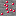
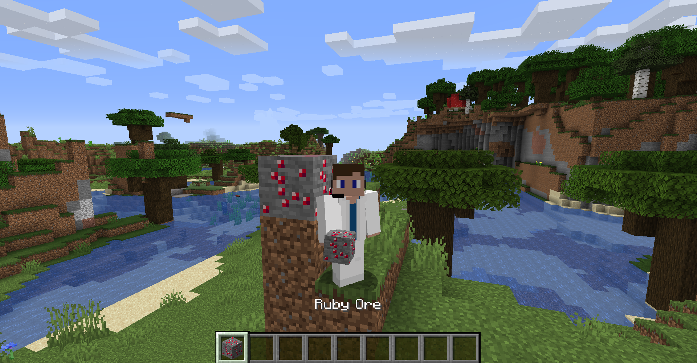

# <a name="blocks"></a>Blocks
---

Now that you have created your first item. It's now time to expand your horizons into the world of blocks. In this tutorial, we will take a deep dive into creating blocks. Specifically, we will be creating a basic block (along with its item) along with a breakdown of everything within the class itself.

## <a name="registry-setup"></a>Registry Setup
---

First let's setup a `DeferredRegister` and add it to our event bus via `Tutorial::addRegistries` where `Tutorial` is our main mod file. This should be done similarly to how we did it within the [`DeferredRegister`](../introduction/registries#deferredregister) section of the registries overview;

```java
public class TutorialBlocks {

	public static final DeferredRegister<Block> BLOCKS = DeferredRegister.create(ForgeRegistries.BLOCKS, Tutorial.ID);
}
```

```java
public class Tutorial {
	...
	private void addRegistries(final IEventBus modEventBus) {
		...
		TutorialBlocks.BLOCKS.register(modEventBus);
	}
}
```

This might seem like a repeat of the [`Item`](./items) section, which is most definitely what it is. However, we have to address a few extra cases regarding to blocks.

First of all, blocks are not items. A `Block` constitutes something that exists within the `World` while an `Item` is specifically related to something in your inventory. So, how can a `Block` exist in both the `World` and the inventory? It's made up of two parts: the `Block` in the world and the `Item` that you can pick up. For this, any `Block` we have must have the option to be an `Item` as well. So, to deal with this case, we're gonna create a method with the ability to add an `Item` for every `Block` we register.

We know that every `Block` must have a `String` registry name and a `Block` instance passed into it, but what about the `Item`? That's a little less clear. To easily register a `Block` as an `Item`, we will utilize the `BlockItem` class. However, this also takes in a `Block` as a parameter. So, how do we go about creating a method that allows us to apply a parameter to another parameter? Well, we can simply use a [function](https://docs.oracle.com/javase/8/docs/api/java/util/function/Function.html) to apply our block parameter to our `Item` function. We should also make it `@Nullable` in case we don't want our `Block` to have an `Item`. From there, it's just as simple as calling two registries:

```java
public class TutorialBlocks {
	...
	private static <V extends Block> RegistryObject<V> register(String id, V block, @Nullable Function<V, BlockItem> item) {
		if(item != null) TutorialItems.ITEMS.register(id, () -> item.apply(block));
		return BLOCKS.register(id, () -> block);
	}
}
```

> Note: We do have to return a `RegistryObject` so that we can call this block anywhere within our code.

> Note: We create a generic V such that it extends `Block` so that we know that the block being applied to the function and the block created are the same.

From there, let's create our basic block. In this example, we will use **ruby ore**. Since we are not changing anything from the `Block` class, we can just pass in a new `Block` constructor holding a simple new `AbstractBlock$Properties` instance to our `RegistryObject` at the moment along with the standard `BlockItem` constructor:

```java
public class TutorialBlocks {
	...
	public static final RegistryObject<Block> RUBY_ORE = register("ruby_ore", new Block(AbstractBlock.Properties.create(Material.ROCK)), block -> new BlockItem(block, new Item.Properties()));
	...
}
```

> Note: `AbstractBlock$Properties`'s constructor is private so it must be accessed through `AbstractBlock$Properties::create`. The most basic implementation takes in a `Material`. So, I will use `Material::ROCK` until we go over in-depth what everything is.

## <a name="resource-setup"></a>Resource Setup
---

Now we are missing a few things. I will not be going over the [texture file](./items#texture-file) or [language localization](./items#language-localization) as those remain exactly the same besides each item instance being replaced with block. So, let create that file tree now:

<div style="text-align:center">

</div>

```
assets/tutorial
├── lang
│	└── en_us.json
├── models
│	└── item
└── textures
	└── block
		└── ruby_ore.png
```

There are a few things I will discuss, such as the block state mapper, block model, item model. However, anything else is just excess baggage until we get to [Data Generators](#). This will allow us to generate everything (except for custom models and textures) without needing to write it by hand.

### <a name="block-and-item-model"></a> Block and Item Model

I have already discussed a basic understanding of this back in [Items](./items) so if you like to have a shallow dive into it, take a look there. In this case, we won't be doing anything special, so let's just create a basic block and item model to use.

There are many different block models to choose from. However, since we only have one texture, we want a model that maps all sides and the particle effect to a single texture. In this case, `minecraft:block/cube_all` allows us to do this with a reference name of `all`.

```json
{
  "parent": "minecraft:block/cube_all",
  "textures": {
    "all": "tutorial:block/ruby_ore"
  }
}
```

For our item model, since the `parent` gets all the attributes of the previous model, we just need to redirect the `parent` to our block model.

```json
{
	"parent": "tutorial:block/ruby_ore"
}
```

As for where to save these files, they each go in their respective object folder inside `models`.

```
assets/tutorial
├── lang
│	└── en_us.json
├── models
│	├── block
│	│	└── ruby_ore.json
│	└── item
│		└── ruby_ore.json
└── textures
	└── block
		└── ruby_ore.png
```

> Note: The block model does not have to be named `ruby_ore.json` as it is called via reference from a block state mapper. However, a good practice is to name your block models such that it includes the name of the `Block` somewhere within it.

### <a name="block-state-mapper"></a> Block State Mapper

[Block States](https://mcforge.readthedocs.io/en/latest/blocks/states/) are one of the most important things to know for creating more advanced blocks that I won't be covering right now. The link above will giev you a decent rundown for anyone wanting a better understanding until we cover it. 

For now, this should suffice. A `BlockState` is a representation of a `Block` in the `World` at a specific moment. A `Block` can have a wide variety of properties such as what direction its facing or how the block is rotated. A `BlockState` takes that information and converts it into useable properties within the world that can be adjusted using a variety of different methods within the class. This is where a `BlockState` mapper comes in. It takes the information provided by the `BlockState` and displays the correct model according to the current state.

In our case, our `Block` only has one state, so no variants need to be specified. In this JSON mapper, to specify an empty state within `variants`, we just represent it as an empty string. From there, the object holds the `model` location. Remember that `domain:location` in this case maps to `domain/models/location` and will be located in our `blockstates` folder.

```json
{
  "variants": {
    "": {
      "model": "tutorial:block/ruby_ore"
    }
  }
}
```

```
assets/tutorial
├── lang
│	└── ruby_ore.json
├── lang
│	└── en_us.json
├── models
│	├── block
│	│	└── ruby_ore.json
│	└── item
│		└── ruby_ore.json
└── textures
	└── block
		└── ruby_ore.png
```



As you can see, we now have our `Block` fully added to the game!

## <a name="blocks-in-depth"></a>Block In-Depth
---

Now that we have completed the main portion of our tutorial, it's now time to take a more in-depth perspective in regards to the `Block` class and the `AbstractBlock$Properties` it provides.

> Note: Although you can create a `AbstractBlock`, the only purpose is to specify the bare minimum to be a `Block` and to hold the properties. You should always use the `Block` class when extending.

### <a name="material"></a>Material

To be able to create an `AbstractBlock$Properties`, you need to supply the intializer function with a `Material`. Which `Material` you choose depends on the specific scenario. Here are all the default materials to choose from.

Material | `MaterialColor` | Liquid | Solid | Blocks Movement | Opaque | Flammable | Replaceable | `PushReaction`
--- | :---: | :---: | :---: | :---: | :---: | :---: | :---: | :---:
`AIR` | `AIR` | :x: | :x: | :x: | :x: | :x: | :heavy_check_mark: | `NORMAL`
`STRUCTURE_VOID` | `AIR` | :x: | :x: | :x: | :x: | :x: | :heavy_check_mark: | `NORMAL`
`PORTAL` | `AIR` | :x: | :x: | :x: | :x: | :x: | :x: | `BLOCK`
`CARPET` | `WOOL` | :x: | :x: | :x: | :x: | :heavy_check_mark: | :x: | `NORMAL`
`PLANTS` | `FOLIAGE` | :x: | :x: | :x: | :x: | :x: | :x: | `DESTROY`
`OCEAN_PLANT` | `WATER` | :x: | :x: | :x: | :x: | :x: | :x: | `DESTROY`
`TALL_PLANTS` | `FOLIAGE` | :x: | :x: | :x: | :x: | :heavy_check_mark: | :heavy_check_mark: | `DESTROY`
`SEA_GRASS` | `WATER` | :x: | :x: | :x: | :x: | :x: | :heavy_check_mark: | `DESTROY`
`WATER` | `WATER` | :heavy_check_mark: | :x: | :x: | :x: | :x: | :heavy_check_mark: | `DESTROY`
`BUBBLE_COLUMN` | `WATER` | :heavy_check_mark: | :x: | :x: | :x: | :x: | :heavy_check_mark: | `DESTROY`
`LAVA` | `TNT` | :heavy_check_mark: | :x: | :x: | :x: | :x: | :heavy_check_mark: | `DESTROY`
`SNOW` | `SNOW` | :x: | :x: | :x: | :x: | :x: | :heavy_check_mark: | `DESTROY`
`FIRE` | `AIR` | :x: | :x: | :x: | :x: | :x: | :heavy_check_mark: | `DESTROY`
`MISCELLANEOUS` | `AIR` | :x: | :x: | :x: | :x: | :x: | :x: | `DESTROY`
`WEB` | `WOOL` | :x: | :heavy_check_mark: | :x: | :x: | :x: | :x: | `DESTROY`
`REDSTONE_LIGHT` | `AIR` | :x: | :heavy_check_mark: | :heavy_check_mark: | :heavy_check_mark: | :x: | :x: | `NORMAL`
`CLAY` | `CLAY` | :x: | :heavy_check_mark: | :heavy_check_mark: | :heavy_check_mark: | :x: | :x: | `NORMAL`
`EARTH` | `DIRT` | :x: | :heavy_check_mark: | :heavy_check_mark: | :heavy_check_mark: | :x: | :x: | `NORMAL`
`ORGANIC` | `GRASS` | :x: | :heavy_check_mark: | :heavy_check_mark: | :heavy_check_mark: | :x: | :x: | `NORMAL`
`PACKED_ICE` | `ICE` | :x: | :heavy_check_mark: | :heavy_check_mark: | :heavy_check_mark: | :x: | :x: | `NORMAL`
`SAND` | `SAND` | :x: | :heavy_check_mark: | :heavy_check_mark: | :heavy_check_mark: | :x: | :x: | `NORMAL`
`SPONGE` | `YELLOW` | :x: | :heavy_check_mark: | :heavy_check_mark: | :heavy_check_mark: | :x: | :x: | `NORMAL`
`SHULKER` | `PURPLE` | :x: | :heavy_check_mark: | :heavy_check_mark: | :heavy_check_mark: | :x: | :x: | `NORMAL`
`WOOD` | `WOOD` | :x: | :heavy_check_mark: | :heavy_check_mark: | :heavy_check_mark: | :heavy_check_mark: | :x: | `NORMAL`
`NETHER_WOOD (field_237214_y_)` | `WOOD` | :x: | :heavy_check_mark: | :heavy_check_mark: | :heavy_check_mark: | :x: | :x: | `NORMAL`
`BAMBOO_SAPLING` | `WOOD` | :x: | :heavy_check_mark: | :x: | :heavy_check_mark: | :heavy_check_mark: | :x: | `DESTROY`
`BAMBOO` | `WOOD` | :x: | :heavy_check_mark: | :heavy_check_mark: | :heavy_check_mark: | :heavy_check_mark: | :x: | `DESTROY`
`WOOL` | `WOOL` | :x: | :heavy_check_mark: | :heavy_check_mark: | :heavy_check_mark: | :heavy_check_mark: | :x: | `NORMAL`
`TNT` | `TNT` | :x: | :heavy_check_mark: | :heavy_check_mark: | :x: | :heavy_check_mark: | :x: | `NORMAL`
`LEAVES` | `FOLIAGE` | :x: | :heavy_check_mark: | :heavy_check_mark: | :x: | :heavy_check_mark: | :x: | `DESTROY`
`GLASS` | `AIR` | :x: | :heavy_check_mark: | :heavy_check_mark: | :x: | :x: | :x: | `NORMAL`
`ICE` | `ICE` | :x: | :heavy_check_mark: | :heavy_check_mark: | :x: | :x: | :x: | `NORMAL`
`CACTUS` | `FOLIAGE` | :x: | :heavy_check_mark: | :heavy_check_mark: | :x: | :x: | :x: | `DESTROY`
`ROCK` | `STONE` | :x: | :heavy_check_mark: | :heavy_check_mark: | :heavy_check_mark: | :x: | :x: | `NORMAL`
`IRON` | `IRON` | :x: | :heavy_check_mark: | :heavy_check_mark: | :heavy_check_mark: | :x: | :x: | `NORMAL`
`SNOW_BLOCK` | `SNOW` | :x: | :heavy_check_mark: | :heavy_check_mark: | :heavy_check_mark: | :x: | :x: | `NORMAL`
`ANVIL` | `IRON` | :x: | :heavy_check_mark: | :heavy_check_mark: | :heavy_check_mark: | :x: | :x: | `BLOCK`
`BARRIER` | `AIR` | :x: | :heavy_check_mark: | :heavy_check_mark: | :heavy_check_mark: | :x: | :x: | `BLOCK`
`PISTON` | `STONE` | :x: | :heavy_check_mark: | :heavy_check_mark: | :heavy_check_mark: | :x: | :x: | `BLOCK`
`CORAL` | `FOLIAGE` | :x: | :heavy_check_mark: | :heavy_check_mark: | :heavy_check_mark: | :x: | :x: | `DESTROY`
`GOURD` | `FOLIAGE` | :x: | :heavy_check_mark: | :heavy_check_mark: | :heavy_check_mark: | :x: | :x: | `DESTROY`
`DRAGON_EGG` | `FOLIAGE` | :x: | :heavy_check_mark: | :heavy_check_mark: | :heavy_check_mark: | :x: | :x: | `DESTROY`
`CAKE` | `AIR` | :x: | :heavy_check_mark: | :heavy_check_mark: | :heavy_check_mark: | :x: | :x: | `DESTROY`

If none of these `Material`s contain all the properties you need, you can just create your own using the constructor or through its static initializer (depending on if it has all the fields you need).

> Note: If you want to add your own `MaterialColor`, it only supports a list of 64 colors. Currently, there are 59 already taken by vanilla Minecraft. So this leaves 5 colors remaining across all mods. So, I would just recommend sticking to what is already in the game.

### <a name="abstractblock-properties"></a>AbstractBlock$Properties

All `Block`s are initialized with a new instance of an `AbstractBlock$Properties` object called via `AbstractBlock$Properties::create`. This class determines the various properties of our `Block`. Each method can be [chained](https://www.geeksforgeeks.org/method-chaining-in-java-with-examples/) I will be adding some of these properties to our ruby ore to make it act more like an actual `Block`.

Method | Parameter(s) | Default | Use
--- | :---: | :---: | ---
`create` | `Material` materialIn | NONE | Creates a `AbstractBlock$Properties` with a certain `Material` and its default `MaterialColor`.
`create` | `Material` materialIn<br>`DyeColor` color | NONE | Creates a `AbstractBlock$Properties` with a certain `Material` the `MaterialColor` associated with a certain dye.
`create` | `Material` materialIn<br>`MaterialColor` mapColorIn | NONE | Creates a `AbstractBlock$Properties` with a certain `Material` and `MaterialColor`.
`create (func_235836_a_)` | `Material` materialIn (p\_235836\_0\_)<br>`Function<BlockState, MaterialColor>` mapColorFunctionIn (p\_235836\_1\_) | NONE | Creates a `AbstractBlock$Properties` with a certain `Material` and `MaterialColor` dependent on the `BlockState`.
`from` | `AbstractBlock` blockIn | NONE | Creates a `AbstractBlock$Properties` with the same properties as another `AbstractBlock`.
`doesNotBlockMovement` | NONE | true | Makes an `AbstractBlock` able to be moved through with no collision (e.g. grass, flowers, etc.).
`notSolid` | NONE | true | Specifies an `AbstractBlock` to be not solid or that light can pass through it.
`harvestLevel` | NONE | -1 | Sets the harvest level of an `AbstractBlock` (e.g. 0 is wood, 1 is stone, 2 is iron, 3 is diamond).
`harvestTool` | NONE | `null` | Sets the harvest tool of an `AbstractBlock`. This does not explicity state that the block must be broken by this tool to be harvested, merely, this tool will improve the efficiency of mining.
`slipperiness` | `float` slipperinessIn | 0.6f | Sets how slippery when walking upon. The greater the number, the more slipperty the `AbstractBlock` is.
`speedFactor` | `float` factor | 1.0f | Determines how fast you can walk over the `AbstractBlock`. The greater the number, the fast you can walk on it.
`jumpFactor` | `float` factor | 1.0f | Determines how high you can jump off the `AbstractBlock`. The greater the number, the higher you can jump.
`sound` | `SoundType` soundTypeIn | `STONE` | Sets the sound information on what to play during certain actions.
`lightValue (func_235838_a_)` | `ToIntFunction<BlockState>` intFunctionIn (p\_235838\_1\_) | 0 | Sets the light level of an `AbstractBlock` dependent on the `BlockState`.
`hardnessAndResistance` | `float` hardnessIn<br>`float` resistanceIn | 0 | Sets the hardness and resistance of an `AbstractBlock`. Hardness represents the time taken to mine while resistance refers to its blast resistance.
`zeroHardnessAndResistance` | NONE | 0 | Sets the hardness and resistance of an `AbstractBlock` to zero.
`hardnessAndResistance` | `float` hardnessAndResistance | 0 | Sets the hardness and resistance of an `AbstractBlock` to the same value.
`tickRandomly` | NONE | false | Allows the `AbstractBlock` to tick randomly calling `AbstractBlock::randomTick` when ticked.
`variableOpacity` | NONE | false | Sets that the `AbstractBlock` has a varying level of transparency.
`noDrops` | NONE | `LootTables::EMPTY` | Makes the `AbstractBlock` not drop anything.
`lootFrom` | `Block` blockIn | Block Loot Table Location | Sets the `AbstractBlock` to drop loot corresponding to another `Block`.
`air (func_235859_g_)` | NONE | false | Sets the `AbstractBlock` to be recognized as air. This should not be used unless you are creating a new type of air.
`canEntitySpawnOn (func_235827_a_)` | `AbstractBlock.IExtendedPositionPredicate<EntityType<?>>` spawnTestFunction (p\_235827\_1\_) | `Block` is solid (on spawn side) and light is less than 14 | Sets a function to determine if an `Entity` can spawn on this `AbstractBlock`. This is just a general caes for all entities and can be more specifically tuned from an entity spawn placement function.
`isNormalCube (func_235828_a_)` | `AbstractBlock.IPositionPredicate` positionTestFunction (p\_235828\_1\_) | `Material` and `BlockState` opaque | Sets a function to determine whether this `AbstractBlock` should be treated normally (e.g. allow redstone wire on, allow chests to open when above, etc.).
`canSuffocate (func_235842_b_)` | `AbstractBlock.IPositionPredicate` positionTestFunction (p\_235828\_1\_) | `Material` blocks movement and is opaque | Sets a function to determine whether this `AbstractBlock` can suffocate the player.
`causesSuffocation (func_235847_c_)` | `AbstractBlock.IPositionPredicate` positionTestFunction (p\_235828\_1\_) | `Material` blocks movement and is opaque | Sets a function to determine whether this `AbstractBlock` can cause suffocation. Used to determine the overlay the player sees when suffocating.
`needsPostProcessing (func_235852_d_)` | `AbstractBlock.IPositionPredicate` positionTestFunction (p\_235828\_1\_) | false | Sets a function to determine whether this block needs some post processing when being set in the world (e.g. mushrooms and magma blocks).
`isEmissiveRendering (func_235856_e_)` | `AbstractBlock.IPositionPredicate` positionTestFunction (p\_235828\_1\_) | false | Sets a function to determine if this block uses emissive rendering. Only effects light map coordinates by setting it to 0xF000F0.
`requiresTool (func_235861_h_)` | NONE | false | Determines whether this `AbstractBlock` needs a tool to be harvested.

Since I want my ruby ore to have a hardness and resistance of 3 along with a harvest level of an iron pickaxe, I need to chain my methods to include these properties.

```java
public class TutorialBlocks {
	...
	public static final RegistryObject<Block> RUBY_ORE = register("ruby_ore", new Block(AbstractBlock.Properties.create(Material.ROCK).func_235861_h_().hardnessAndResistance(3.0f).harvestTool(ToolType.PICKAXE).harvestLevel(2)), block -> new BlockItem(block, new Item.Properties().group(ItemGroup.BUILDING_BLOCKS)));
	...
}
```

### <a name="extending-a-block"></a>Extending a Block

If you want to add more complex behavior to your `Block`, you would most likely extend the class and store it within the `block` package:

```
src/main/java/io/github/championash5357/tutorial
├── block
│	└── ExtendedBlock.java
├── client
├── init
├── item
├── proxy
├── server
└── Tutorial.java
```

If you wanted to do something when an block was activated, for example, you would `@Override` a specific method and implement your code within the method. 

Before I give you a list of all the methods within the class, I want to first mention something about **Deprecation**. Sometimes when Forge deprecates a method, it is because they added a more sensitive version to be used. Other times, there already exists a more sensitive version and that method should be called instead. So, to separate the two, here is what will happen. If I write **Deprecated Call**, this refers to the method should be accessed via a different class, most likely `BlockState`. If I write, **Deprecated Method**, this refers to that the method should not be accessed whatsoever and that a different method should be used instead.

Here are all the methods provided by the `Block` class that you might override or use.

Implementation | Method | Parameter(s) | Return Type | Use
--- | :---: | :---: | :---: | ---
`Object` | `toString` | NONE | `String` | Returns the registry path of the `Block`.
`AbstractBlock` | `updateDiagonalNeighbors` | `BlockState` state<br>`IWorld` worldIn<br>`BlockPos` pos<br>`int` flags<br>`int` p\_196248\_5\_ | `void` | Updates the diagnoal neighbors of the block. p\_196248\_5\_ has something to do with notifications of neighbor reactions defaults to 512 or 511 a lot. **Deprecated Call** Should be referenced through `AbstractBlockState::updateDiagonalNeighbors` or `AbstractBlockState::func_241483_b_`.
`AbstractBlock` | `allowsMovement` | `BlockState` state<br>`IBlockReader` worldIn<br>`BlockPos` pos<br>`PathType` type | `boolean` | Returns whether a certain `PathType` can move through the block. **Deprecated Call** Should be referenced through `AbstractBlockState::allowsMovement`.
`AbstractBlock` | `updatePostPlacement` | `BlockState` stateIn<br>`Direction` facing<br>`BlockState` facingState<br>`IWorld` worldIn<br>`BlockPos` currentPos<br>`BlockPos` facingPos | `BlockState` | Update the provided state given the provided neighbor facing and neighbor state, returning a new state. **Deprecated Call** Should be referenced through `AbstractBlockState::updatePostPlacement`.
`AbstractBlock` | `isSideInvisible` | `BlockState` state<br>`BlockState` adjacentBlockState<br>`Direction` side | `boolean` | Returns whether the side should be not rendered. **Deprecated Call** Should be referenced through `AbstractBlockState::isSideInvisible`.
`AbstractBlock` | `neighborChanged` | TODO | TODO | TODO
`AbstractBlock` | `onBlockAdded` | TODO | TODO | TODO
`AbstractBlock` | `onReplaced` | TODO | TODO | TODO
`AbstractBlock` | `onBlockActivated` | TODO | TODO | TODO
`AbstractBlock` | `eventReceived` | TODO | TODO | TODO
`AbstractBlock` | `getRenderType` | TODO | TODO | TODO
`AbstractBlock` | `isTransparent` | TODO | TODO | TODO
`AbstractBlock` | `canProvidePower` | TODO | TODO | TODO
`AbstractBlock` | `getPushReaction` | TODO | TODO | TODO
`AbstractBlock` | `getFluidState` | TODO | TODO | TODO
`AbstractBlock` | `hasComparatorInputOverride` | TODO | TODO | TODO
`AbstractBlock` | `getOffsetType` | TODO | TODO | TODO
`AbstractBlock` | `rotate` | TODO | TODO | TODO
`AbstractBlock` | `mirror` | TODO | TODO | TODO
`AbstractBlock` | `isReplaceable` | TODO | TODO | TODO
`AbstractBlock` | `isReplaceable` | TODO | TODO | TODO
`AbstractBlock` | `getDrops` | TODO | TODO | TODO
`AbstractBlock` | `getPositionRandom` | TODO | TODO | TODO
`AbstractBlock` | `getRenderShape` | TODO | TODO | TODO
`AbstractBlock` | `func_230335_e_` | TODO | TODO | TODO
`AbstractBlock` | `getRaytraceShape` | TODO | TODO | TODO
`AbstractBlock` | `getOpacity` | TODO | TODO | TODO
`AbstractBlock` | `getContainer` | TODO | TODO | TODO
`AbstractBlock` | `isValidPosition` | TODO | TODO | TODO
`AbstractBlock` | `getAmbientOcclusionLightValue` | TODO | TODO | TODO
`AbstractBlock` | `getComparatorInputOverride` | TODO | TODO | TODO
`AbstractBlock` | `getShape` | TODO | TODO | TODO
`AbstractBlock` | `getCollisionShape` | TODO | TODO | TODO
`AbstractBlock` | `func_230322_a_` | TODO | TODO | TODO
`AbstractBlock` | `randomTick` | TODO | TODO | TODO
`AbstractBlock` | `tick` | TODO | TODO | TODO
`AbstractBlock` | `getPlayerRelativeBlockHardness` | TODO | TODO | TODO
`AbstractBlock` | `spawnAdditionalDrops` | TODO | TODO | TODO
`AbstractBlock` | `onBlockClicked` | TODO | TODO | TODO
`AbstractBlock` | `getWeakPower` | TODO | TODO | TODO
`AbstractBlock` | `onEntityCollision` | TODO | TODO | TODO
`AbstractBlock` | `getStrongPower` | TODO | TODO | TODO
`AbstractBlock` | `func_235695_q_` | TODO | TODO | TODO
`AbstractBlock` | `getLootTable` | TODO | TODO | TODO
`AbstractBlock` | `onProjectileCollision` | TODO | TODO | TODO
`AbstractBlock` | `asItem` | TODO | TODO | TODO
`AbstractBlock` | `func_230328_p_` | TODO | TODO | TODO
`AbstractBlock` | `func_235697_s_` | TODO | TODO | TODO
`Block` | `getStateId` | TODO | TODO | TODO
`Block` | `getStateId` | TODO | TODO | TODO
`Block` | `getBlockFromItem` | TODO | TODO | TODO
`Block` | `nudgeEntitiesWithNewState` | TODO | TODO | TODO
`Block` | `makeCuboidShape` | TODO | TODO | TODO
`Block` | `isIn` | TODO | TODO | TODO
`Block` | `func_235332_a_` | TODO | TODO | TODO
`Block` | `getValidBlockForPosition` | TODO | TODO | TODO
`Block` | `replaceBlock` | TODO | TODO | TODO
`Block` | `func_241468_a_` | TODO | TODO | TODO
`Block` | `cannotAttach` | TODO | TODO | TODO
`Block` | `ticksRandomly` | TODO | TODO | TODO
`Block` | `shouldSideBeRendered` | TODO | TODO | TODO
`Block` | `hasSolidSideOnTop` | TODO | TODO | TODO
`Block` | `hasEnoughSolidSide` | TODO | TODO | TODO
`Block` | `hasSolidSide` | TODO | TODO | TODO
`Block` | `doesSideFillSquare` | TODO | TODO | TODO
`Block` | `isOpaque` | TODO | TODO | TODO
`Block` | `propagatesSkylightDown` | TODO | TODO | TODO
`Block` | `animateTick` | TODO | TODO | TODO
`Block` | `onPlayerDestroy` | TODO | TODO | TODO
`Block` | `getDrops` | TODO | TODO | TODO
`Block` | `getDrops` | TODO | TODO | TODO
`Block` | `spawnDrops` | TODO | TODO | TODO
`Block` | `spawnDrops` | TODO | TODO | TODO
`Block` | `spawnDrops` | TODO | TODO | TODO
`Block` | `spawnAsEntity` | TODO | TODO | TODO
`Block` | `dropXpOnBlockBreak` | TODO | TODO | TODO
`Block` | `getExplosionResistance` | TODO | TODO | TODO
`Block` | `onExplosionDestroy` | TODO | TODO | TODO
`Block` | `onEntityWalk` | TODO | TODO | TODO
`Block` | `getStateForPlacement` | TODO | TODO | TODO
`Block` | `harvestBlock` | TODO | TODO | TODO
`Block` | `onBlockPlacedBy` | TODO | TODO | TODO
`Block` | `canSpawnInBlock` | TODO | TODO | TODO
`Block` | `func_235333_g_` | TODO | TODO | TODO
`Block` | `getTranslationKey` | TODO | TODO | TODO
`Block` | `onFallenUpon` | TODO | TODO | TODO
`Block` | `onLanded` | TODO | TODO | TODO
`Block` | `getItem` | TODO | TODO | TODO
`Block` | `fillItemGroup` | TODO | TODO | TODO
`Block` | `getSlipperiness` | TODO | TODO | TODO
`Block` | `getSpeedFactor` | TODO | TODO | TODO
`Block` | `getJumpFactor` | TODO | TODO | TODO
`Block` | `onBlockHarvested` | TODO | TODO | TODO
`Block` | `fillWithRain` | TODO | TODO | TODO
`Block` | `canDropFromExplosion` | TODO | TODO | TODO
`Block` | `fillStateContainer` | TODO | TODO | TODO
`Block` | `getStateContainer` | TODO | TODO | TODO
`Block` | `setDefaultState` | TODO | TODO | TODO
`Block` | `getDefaultState` | TODO | TODO | TODO
`Block` | `getSoundType` | TODO | TODO | TODO
`Block` | `isVariableOpacity` | TODO | TODO | TODO
`Block` | `addInformation` | TODO | TODO | TODO
`Block` | `func_230328_p_` | TODO | TODO | TODO
`IItemProvider` | `asItem` | TODO | TODO | TODO
`IForgeBlock` | `getBlock` | TODO | TODO | TODO
`IForgeBlock` | `getSlipperiness` | TODO | TODO | TODO
`IForgeBlock` | `getLightValue` | TODO | TODO | TODO
`IForgeBlock` | `isLadder` | TODO | TODO | TODO
`IForgeBlock` | `isBurning` | TODO | TODO | TODO
`IForgeBlock` | `hasTileEntity` | TODO | TODO | TODO
`IForgeBlock` | `createTileEntity` | TODO | TODO | TODO
`IForgeBlock` | `canHarvestBlock` | TODO | TODO | TODO
`IForgeBlock` | `removedByPlayer` | TODO | TODO | TODO
`IForgeBlock` | `isBed` | TODO | TODO | TODO
`IForgeBlock` | `canCreatureSpawn` | TODO | TODO | TODO
`IForgeBlock` | `getBedSpawnPosition` | TODO | TODO | TODO
`IForgeBlock` | `setBedOccupied` | TODO | TODO | TODO
`IForgeBlock` | `getBedDirection` | TODO | TODO | TODO
`IForgeBlock` | `isAir` | TODO | TODO | TODO
`IForgeBlock` | `canBeReplacedByLeaves` | TODO | TODO | TODO
`IForgeBlock` | `canBeReplacedByLogs` | TODO | TODO | TODO
`IForgeBlock` | `getExplosionResistance` | TODO | TODO | TODO
`IForgeBlock` | `canConnectRedstone` | TODO | TODO | TODO
`IForgeBlock` | `getPickBlock` | TODO | TODO | TODO
`IForgeBlock` | `addLandingEffects` | TODO | TODO | TODO
`IForgeBlock` | `addRunningEffects` | TODO | TODO | TODO
`IForgeBlock` | `addHitEffects` | TODO | TODO | TODO
`IForgeBlock` | `addDestroyEffects` | TODO | TODO | TODO
`IForgeBlock` | `canSustainPlant` | TODO | TODO | TODO
`IForgeBlock` | `onPlantGrow` | TODO | TODO | TODO
`IForgeBlock` | `isFertile` | TODO | TODO | TODO
`IForgeBlock` | `isBeaconBase` | TODO | TODO | TODO
`IForgeBlock` | `isConduitFrame` | TODO | TODO | TODO
`IForgeBlock` | `isPortalFrame` | TODO | TODO | TODO
`IForgeBlock` | `getExpDrop` | TODO | TODO | TODO
`IForgeBlock` | `rotate` | TODO | TODO | TODO
`IForgeBlock` | `getEnchantPowerBonus` | TODO | TODO | TODO
`IForgeBlock` | `onNeighborChange` | TODO | TODO | TODO
`IForgeBlock` | `observedNeighborChange` | TODO | TODO | TODO
`IForgeBlock` | `shouldCheckWeakPower` | TODO | TODO | TODO
`IForgeBlock` | `getWeakChanges` | TODO | TODO | TODO
`IForgeBlock` | `getHarvestTool` | TODO | TODO | TODO
`IForgeBlock` | `getHarvestLevel` | TODO | TODO | TODO
`IForgeBlock` | `isToolEffective` | TODO | TODO | TODO
`IForgeBlock` | `getSoundType` | TODO | TODO | TODO
`IForgeBlock` | `getBeaconColorMultiplier` | TODO | TODO | TODO
`IForgeBlock` | `getFogColor` | TODO | TODO | TODO
`IForgeBlock` | `getStateAtViewpoint` | TODO | TODO | TODO
`IForgeBlock` | `getAiPathNodeType` | TODO | TODO | TODO
`IForgeBlock` | `isSlimeBlock` | TODO | TODO | TODO
`IForgeBlock` | `isStickyBlock` | TODO | TODO | TODO
`IForgeBlock` | `canStickTo` | TODO | TODO | TODO
`IForgeBlock` | `getFlammability` | TODO | TODO | TODO
`IForgeBlock` | `isFlammable` | TODO | TODO | TODO
`IForgeBlock` | `catchFire` | TODO | TODO | TODO
`IForgeBlock` | `getFireSpreadSpeed` | TODO | TODO | TODO
`IForgeBlock` | `isFireSource` | TODO | TODO | TODO
`IForgeBlock` | `canEntityDestroy` | TODO | TODO | TODO
`IForgeBlock` | `canDropFromExplosion` | TODO | TODO | TODO
`IForgeBlock` | `getTags` | TODO | TODO | TODO
`IForgeBlock` | `onBlockExploded` | TODO | TODO | TODO
`IForgeBlock` | `collisionExtendsVertically` | TODO | TODO | TODO
`IForgeBlock` | `shouldDisplayFluidOverlay` | TODO | TODO | TODO

---
All files are uploaded to the [GitHub](https://github.com/ChampionAsh5357/1.16.x-Minecraft-Tutorial/tree/1.16.1-32.0.61-web) under **Block**.

If you want to find more specific examples about blocks, go to [Block Extensions](../../#block-extensions).

Back to [Items](./items)  
Back to [Minecraft Tutorials](../../)  