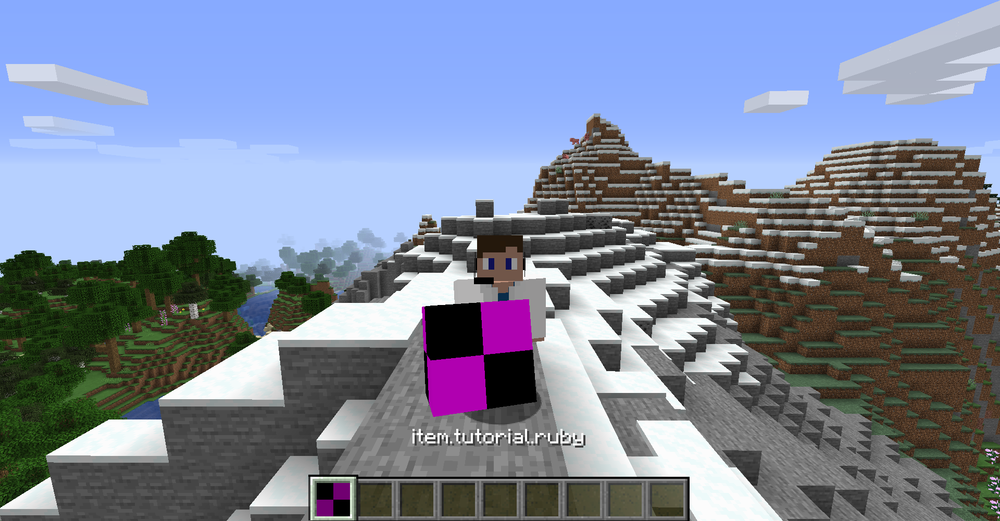
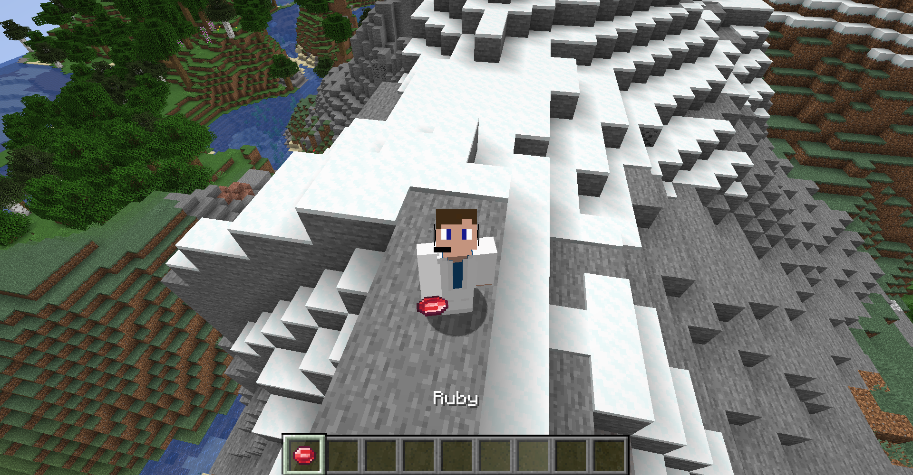

# <a name="items"></a>Items
---

Welcome you novice modders! Congrats on completing the Introduction into Minecraft programming with Forge. In this tutorial, we will take a deep dive into creating items. Specifically, we will be creating a basic item along with a breakdown of everything within the class itself.

## <a name="registry-setup"></a>Registry Setup
---

First let's setup a `DeferredRegister` and add it to our event bus via `Tutorial::addRegistries` where `Tutorial` is our main mod file. This should be done similarly to how we did it within the [`DeferredRegister`](../introduction/registries#deferredregister) section of the registries overview;

```java
public class TutorialItems {

	public static final DeferredRegister<Item> ITEMS = DeferredRegister.create(ForgeRegistries.ITEMS, Tutorial.ID);
}
```
```java
public class Tutorial {
	...
	private void addRegistries(final IEventBus modEventBus) {
		TutorialItems.ITEMS.register(modEventBus);
	}
}
```

From there, let's create our basic item. In this example, we will use a **ruby**. Since we are not changing anything from the `Item` class, we can just pass in a new `Item` constructor holding a new `Item$Properties` instance to our `RegistryObject` at the moment:

```java
public class TutorialItems {

	public static final DeferredRegister<Item> ITEMS = DeferredRegister.create(ForgeRegistries.ITEMS, Tutorial.ID);

	public static final RegistryObject<Item> RUBY = ITEMS.register("ruby", () -> new Item(new Item.Properties()));
}
```

> Note that we don't have to call the constructor for the `Item$Properties` from its main class. We could easily call it as `new Properties()` instead of `new Item.Properties()`. We mainly do this because there are multiple classes named `Properties`, so this helps us differentiate them.

Now if you load up the game, you can use the `give` command (like so `/give @p tutorial:ruby`) to give yourself the `Item`:



What's going on? Our `Item` is in the game, but it's missing a lot of things. As you can see, if we never give our `Item` a texture or a model, it will appear as the default missing texture model in-game. If we also don't add a localization string for our language, it will also appear as its default translation key (e.g. `item.tutorial.ruby`).

## <a name="resource-setup"></a>Resource Setup
---

To do this, we're gonna need to update the file tree a bit. Currently we have the following file tree from our `src` folder:

```
src
└── main
	├── java
	│	└── io
	│		└── github
	│			└── championash5357
	│				└── tutorial
	│					├── client
	│					│	└── proxy
	│					│		└── ClientProxy.java
	│					├── init
	│					│	└── TutorialItems.java
	│					├── proxy
	│					│	└── IProxy.java
	│					├── server
	│					│	└── proxy
	│					│		└── ServerProxy.java
	│					└── Tutorial.java
	│
	└── resources
		├── pack.mcmeta
		└── META-INF
			└── mods.toml
```

Let's condense this down further to only reference our `src/main/resources` folder:

```
src/main/resources
├── pack.mcmeta
└── META-INF
	└── mods.toml
```

To generate anything that has to do with game assets (sounds, models, textures, etc.), we need to create a folder called `assets`. From there, to specify that this is for our mod, we need to add another folder within that with our mod id (e.g. `examplemod` or in this case `tutorial`).

```
src/main/resources
├── assets
│	└── tutorial
├── pack.mcmeta
└── META-INF
	└── mods.toml
```

From there, we need to add a few more directories/folders to `assets/tutorial`. First, our language localization files will be stored within the `lang` folder. Next, models shall be stored in the `models` folder. Since we are working with `Item` models, the `models` folder will have a subdirectory called `item`. Finally, textures shall be stored in the `textures` folder. Once again, since we are working with `Item`s, this will be stored in a subdirectory called `item`. Here is a view from the `assets/tutorial` folder:

```
assets/tutorial
├── lang
├── models
│	└── item
└── textures
	└── item
```

When we create anything that has to do with items from now on, I will be referring to these specific folders. 

### <a name="texture-file"></a>Texture File

Texture files are stored within `textures/item` as a **Portable Network Graphics (PNG)** file. Textures are traditionally 16 by 16 pixels, however they can be expanded to any size. You can also have a [animated texture](https://minecraft.gamepedia.com/Resource_Pack#Textures) by making the height increase by a multiple of the sides (e.g. 16 x 32 would have two 16 x 16 images to cycle through). To specify a animated texture, add another file on top of the image file that appends `.mcmeta` to the end (e.g. `test.png` would have another file called `test.png.mcmeta`). Take a look at the above link if you would like to learn more.

> Note: Textures are stretched and compressed according to the model. Unless otherwise specified as a dynamic texture or by the UV mapping of the model, the texture will be mapped to each individual pixel by ratio. For example: if I had a 32 by 256 pixel texture with no dynamic mappings, it would be compressed by a factor by 2 on the width and a factor of 16 on the height, resulting in a very weird looking texture. The quality of the picture will still remain, so for higher definition textures, stick to a square image with their sides being multiples of 16 pixels.

PNG files have different bit-depths corresponding to how the image will be read. The two we will be reviewing is **PNG-24** and **PNG-32**. **PNG-24** supports all 16 million colors and some background index transparency/matte. If you're image is saved with a 24-bit depth, there will be no transparency rendered within your image whatsoever. **PNG-32** supports all 16 million colors including full alpha transparency. All images within Minecraft are saved in this format. Make sure when you create your image it is saved as a PNG file with 32-bit depth.

For our case, I edited the emerald within Minecraft to make it look like a ruby for our example:

<div style="text-align:center">

</div>

From here, I will save it as a PNG-32 file within our `textures/item` folder resulting in our file tree now looking like this:

```
assets/tutorial
├── lang
├── models
│	└── item
└── textures
	└── item
		└── ruby.png
```

### <a name="item-model"></a>Item Model

Block and item models within Minecraft use exactly the same **JavaScript Object Notation (JSON)** format excluding their locations. If you want a more in-depth explanation of item models, check out the breakdown over at [Minecraft Wiki](https://minecraft.gamepedia.com/Model#Item_models). If you want to create your own, there are many different [modeling softwares](https://blockbench.net/) out there that will help you with that. I will not be going over either of these in-depth, just a basic implementation to get our item rendered in the game.

To create a basic item model, we need to first create a JSON file holding an object like so:

```json
{}
```

Within this object, we need to use the default model provided by Minecraft `item/generated`. This model gives us a basic item look along with predefined render locations. So, we need to add a `parent` variable and give it a value of `minecraft:item/generated`.

```json
{
	"parent": "minecraft:item/generated"
}
```

Finally, to attach our texture to our model, we need to add another object called `textures`. Inside of that, we define our texture location according to a specific  reference name used by the model. In our case, the reference name is `layer0`. We will give this a value of `tutorial:item/ruby`.

> Note: The texture location is determined by the mod id followed by a colon. The colon specifies that we are now in `assets/tutorial/textures`. From there, we go into our `item` folder and grab the name of the texture file used without its extension.

This gives us the following JSON model:

```json
{
	"parent": "minecraft:item/generated",
	"textures": {
		"layer0": "tutorial:item/ruby"
	}
}
```

Now we need to save it within our `models/item` folder under the registry name set for that specific `Item` (e.g. `ruby.json`).

```
assets/tutorial
├── lang
├── models
│	└── item
│		└── ruby.json
└── textures
	└── item
		└── ruby.png
```

### <a name="language-localization"></a>Language Localization

All language localization is handled once again via **JSON** files using what is known as translation keys. A translation key is usually broken down into three parts: the specific object type, the mod id, and then the registry name each separated by a '.'. For almost every object initialized, there will be an associated translated key in this format `object_type.modid.registry_name`. To be able to give our items a name, we need to create a new JSON file once again.

```json
{}
```

Then, we can create a variable of our `object_type.modid.registry_name` (in our case `item.tutorial.ruby`) and set it equal to the name we would like to have.

```json
{
	"item.tutorial.ruby": "Ruby"
}
```

> Note: Any string you create within Minecraft for text display should be passed through a `TranslationTextComponent` with a translation key so that it can be localized in all languages.

From there, we need to save the file name as your [locale code](https://minecraft.gamepedia.com/Language#Available_languages) specified by Minecraft.

> Note: Any non-standard character supported by Minecraft must be referenced via their [Unicode](https://en.wikipedia.org/wiki/Unicode#Standardized_subsets) address (e.g. `\u00ed` for an `í`).

The American English locale code is `en_us`, so we will be saving this file as `en_us.json` within our `lang` folder.

```
assets/tutorial
├── lang
│	└── en_us.json
├── models
│	└── item
│		└── ruby.json
└── textures
	└── item
		└── ruby.png
```



As you can see, we now have our item fully added into the game!

## <a name="common-issues"></a>Common Issues
---

If you correctly added your models and textures and still don't see them in the game, refresh your IDE's file tree by clicking on `src/main/resources` and pressing `F5`. Files added outside the editor do not refresh the file tree. 
Reload your game to test if your resources were added once again.

## <a name="items-in-depth"></a>Items In-Depth
---

Now that we have completed the main portion of our tutorial, it's now time to take a more in-depth perspective in regards to the `Item` class and the `Item$Properties` it provides.

### <a name="item-properties"></a>Item$Properties`

All `Item`s are initialized with a new instance of an `Item$Properties` object. This class determines the various properties of our `Item`. Each method can be [chained](https://www.geeksforgeeks.org/method-chaining-in-java-with-examples/) together allowing us to instantiate our object once without multiple calls (e.g. `new Item.Properties().method1(value1).method2(value2)`). I will be adding one of these properties to our ruby to make it possible to find in the creative menu.

Method | Parameter(s) | Default | Use
--- | :---: | :---: | ---
`food` | `Food` | `null` | Makes an item edible. Applies the stats of the `Food` passed in.
`maxStackSize` | `int` | 64 | Sets the maximum amount of `Item`s this can stack.
`defaultMaxDamage` | `int` | 0 | Sets the maximum amount of damage the `Item` can have along with the maximum stack size to 1 assuming the value wasn't set already.
`maxDamage` | `int` | 0 | Sets the maximum amount of damage the `Item` can have along with the maximum stack size to 1.
`containerItem` | `Item` | `null` | Set a container item. The container item will remain after this `Item` is crafted in recipes.
`group` | `ItemGroup` | `null` | Sets the creative tab the `Item` will appear in.
`rarity` | `Rarity` | `COMMON` | Sets the "rarity" of the `Item`. This is only used to change the color of text the `Item` is displayed with.
`setImmuneToFire (func_234689_a_)` | **NONE** | false | Sets the `Item` to be immune to fire damage.
`setNoRepair` | **NONE** | true | Sets the `Item` to be unrepairable in a grindstone or repair recipes. This is only possible if the `Item` has damage associated with it.
`addToolType` | `ToolType`<br>`int` | `new HashMap<>` | Gives the `Item` an ability to harvest blocks as a specific tool at a specific level. Can be chained to have the properties of multiple tools (e.g. `addToolType(PICKAXE, 2).addToolType(AXE, 1)` gives the `Item` the efficiency of an iron pickaxe and a stone axe).
`setISTER` | `Supplier<Callable<ItemStackTileEntityRenderer>>` | `ItemStackTileEntityRenderer::instance` | Sets a custom `ItemStackTileEntityRenderer` to render an item from a `TileEntityRenderer` or defined `Model` in most cases. `Model` refers to the class used to create `Entity` models usually.

> Note: The maximum stack size and maximum damage cannot coexist on a single item. An item can either have a stack size greater than 1 with no damage or a stack size of 1 with damage.

> Note: `setNoRepair` is bugged in the latest release of Forge so that it always returns false. This list is only accurate as of **v32.0.57**.

Since a standard gem is set within `ItemGroup::MATERIALS`, I will be chaining my property instance to include the `group` method to set this value.

```java
public class TutorialItems {
	...
	public static final RegistryObject<Item> RUBY = ITEMS.register("ruby", () -> new Item(new Item.Properties().group(ItemGroup.MATERIALS)));
}
```

### <a name="extending-an-item"></a>Extending an Item

If you want to add more complex behavior to your item, you would most likely extend the class and store it within the `item` package:

```
src/main/java/io/github/championash5357/tutorial
├── client
├── init
├── item
│	└── ExtendedItem.java
├── proxy
├── server
└── Tutorial.java
```

If you wanted to do something when an item was right-clicked, for example, you would `@Override` a specific method and return your code associated with it. Here are all the method provided by the `Item` class that you might override or use.

Implementation | Method | Parameter(s) | Return Type | Use
--- | :---: | :---: | :---: | ---
`Item` | `onUse` | ##TODO | ##TODO | ##TODO |
`Item` | `updateItemStackNBT` | ##TODO | ##TODO | ##TODO |
`Item` | `canPlayerBreakBlockWhileHolding` | ##TODO | ##TODO | ##TODO |
`Item` | `onItemUse` | ##TODO | ##TODO | ##TODO |
`Item` | `getDestroySpeed` | ##TODO | ##TODO | ##TODO |
`Item` | `onItemRightClick` | ##TODO | ##TODO | ##TODO |
`Item` | `onItemUseFinish` | ##TODO | ##TODO | ##TODO |
`Item` | ~~`getMaxStackSize`~~ | ##TODO | ##TODO | ##TODO |
`Item` | ~~`getMaxDamage`~~ | ##TODO | ##TODO | ##TODO |
`Item` | `isDamageable` | ##TODO | ##TODO | ##TODO |
`Item` | `hitEntity` | ##TODO | ##TODO | ##TODO |
`Item` | `onBlockDestroyed` | ##TODO | ##TODO | ##TODO |
`Item` | `canHarvestBlock` | ##TODO | ##TODO | ##TODO |
`Item` | `itemInteractionForEntity` | ##TODO | ##TODO | ##TODO |
`Item` | `getName` | ##TODO | ##TODO | ##TODO |
`Item` | `getDefaultTranslationKey` | ##TODO | ##TODO | ##TODO |
`Item` | `getTranslationKey` | ##TODO | ##TODO | ##TODO |
`Item` | `getTranslationKey` | ##TODO | ##TODO | ##TODO |
`Item` | `shouldSyncTag` | ##TODO | ##TODO | ##TODO |
`Item` | ~~`getContainerItem`~~ | ##TODO | ##TODO | ##TODO |
`Item` | ~~`hasContainerItem`~~ | ##TODO | ##TODO | ##TODO |
`Item` | `inventoryTick` | ##TODO | ##TODO | ##TODO |
`Item` | `onCreated` | ##TODO | ##TODO | ##TODO |
`Item` | `isComplex` | ##TODO | ##TODO | ##TODO |
`Item` | `getUseAction` | ##TODO | ##TODO | ##TODO |
`Item` | `getUseDuration` | ##TODO | ##TODO | ##TODO |
`Item` | `onPlayerStoppedUsing` | ##TODO | ##TODO | ##TODO |
`Item` | `addInformation` | ##TODO | ##TODO | ##TODO |
`Item` | `getDisplayName` | ##TODO | ##TODO | ##TODO |
`Item` | `hasEffect` | ##TODO | ##TODO | ##TODO |
`Item` | `getRarity` | ##TODO | ##TODO | ##TODO |
`Item` | `isEnchantable` | ##TODO | ##TODO | ##TODO |
`Item` | `rayTrace` | ##TODO | ##TODO | ##TODO |
`Item` | `getItemEnchantability` | ##TODO | ##TODO | ##TODO |
`Item` | `fillItemGroup` | ##TODO | ##TODO | ##TODO |
`Item` | `isInGroup` | ##TODO | ##TODO | ##TODO |
`Item` | `getGroup` | ##TODO | ##TODO | ##TODO |
`Item` | `getIsRepairable` | ##TODO | ##TODO | ##TODO |
`Item` | ~~`getAttributeModifiers`~~ | ##TODO | ##TODO | ##TODO |
`Item` | `isCrossbow` | ##TODO | ##TODO | ##TODO |
`Item` | `getDefaultInstance` | ##TODO | ##TODO | ##TODO |
`Item` | `isIn` | ##TODO | ##TODO | ##TODO |
`Item` | `isFood` | ##TODO | ##TODO | ##TODO |
`Item` | `getFood` | ##TODO | ##TODO | ##TODO |
`Item` | `getDrinkSound` | ##TODO | ##TODO | ##TODO |
`Item` | `getEatSound` | ##TODO | ##TODO | ##TODO |
`Item` | `isImmuneToFire (func_234687_u_)` | ##TODO | ##TODO | ##TODO |
`Item` | `isImmuneToFire (func_234685_a_)` | ##TODO | ##TODO | ##TODO |
`IItemProvider` | `asItem` | ##TODO | ##TODO | ##TODO |
`IForgeItem` | `getAttributeModifiers` | ##TODO | ##TODO | ##TODO |
`IForgeItem` | `onDroppedByPlayer` | ##TODO | ##TODO | ##TODO |
`IForgeItem` | `getHighlightTip` | ##TODO | ##TODO | ##TODO |
`IForgeItem` | `onItemUseFirst` | ##TODO | ##TODO | ##TODO |
`IForgeItem` | `isPiglinCurrency` | ##TODO | ##TODO | ##TODO |
`IForgeItem` | `makesPiglinsNeutral` | ##TODO | ##TODO | ##TODO |
`IForgeItem` | `isRepairable` | ##TODO | ##TODO | ##TODO |
`IForgeItem` | `getXpRepairRatio` | ##TODO | ##TODO | ##TODO |
`IForgeItem` | `getShareTag` | ##TODO | ##TODO | ##TODO |
`IForgeItem` | `readShareTag` | ##TODO | ##TODO | ##TODO |
`IForgeItem` | `onBlockStartBreak` | ##TODO | ##TODO | ##TODO |
`IForgeItem` | `onUsingTick` | ##TODO | ##TODO | ##TODO |
`IForgeItem` | `onLeftClickEntity` | ##TODO | ##TODO | ##TODO |
`IForgeItem` | `getContainerItem` | ##TODO | ##TODO | ##TODO |
`IForgeItem` | `hasContainerItem` | ##TODO | ##TODO | ##TODO |
`IForgeItem` | `getEntityLifespan` | ##TODO | ##TODO | ##TODO |
`IForgeItem` | `hasCustomEntity` | ##TODO | ##TODO | ##TODO |
`IForgeItem` | `createEntity` | ##TODO | ##TODO | ##TODO |
`IForgeItem` | `onEntityItemUpdate` | ##TODO | ##TODO | ##TODO |
`IForgeItem` | `getCreativeTabs` | ##TODO | ##TODO | ##TODO |
`IForgeItem` | `getSmeltingExperience` | ##TODO | ##TODO | ##TODO |
`IForgeItem` | `doesSneakBypassUse` | ##TODO | ##TODO | ##TODO |
`IForgeItem` | `onArmorTick` | ##TODO | ##TODO | ##TODO |
`IForgeItem` | `canEquip` | ##TODO | ##TODO | ##TODO |
`IForgeItem` | `getEquipmentSlot` | ##TODO | ##TODO | ##TODO |
`IForgeItem` | `isBookEnchantable` | ##TODO | ##TODO | ##TODO |
`IForgeItem` | `getArmorTexture` | ##TODO | ##TODO | ##TODO |
`IForgeItem` | `getFontRenderer` | ##TODO | ##TODO | ##TODO |
`IForgeItem` | `getArmorModel` | ##TODO | ##TODO | ##TODO |
`IForgeItem` | `onEntitySwing` | ##TODO | ##TODO | ##TODO |
`IForgeItem` | `renderHelmetOverlay` | ##TODO | ##TODO | ##TODO |
`IForgeItem` | `getDamage` | ##TODO | ##TODO | ##TODO |
`IForgeItem` | `showDurabilityBar` | ##TODO | ##TODO | ##TODO |
`IForgeItem` | `getDurabilityForDisplay` | ##TODO | ##TODO | ##TODO |
`IForgeItem` | `getRGBDurabilityForDisplay` | ##TODO | ##TODO | ##TODO |
`IForgeItem` | `getMaxDamage` | ##TODO | ##TODO | ##TODO |
`IForgeItem` | `isDamaged` | ##TODO | ##TODO | ##TODO |
`IForgeItem` | `setDamage` | ##TODO | ##TODO | ##TODO |
`IForgeItem` | `canHarvestBlock` | ##TODO | ##TODO | ##TODO |
`IForgeItem` | `getItemStackLimit` | ##TODO | ##TODO | ##TODO |
`IForgeItem` | `getToolTypes` | ##TODO | ##TODO | ##TODO |
`IForgeItem` | `getHarvestLevel` | ##TODO | ##TODO | ##TODO |
`IForgeItem` | `getItemEnchantability` | ##TODO | ##TODO | ##TODO |
`IForgeItem` | `canApplyAtEnchantingTable` | ##TODO | ##TODO | ##TODO |
`IForgeItem` | `isBeaconPayment` | ##TODO | ##TODO | ##TODO |
`IForgeItem` | `shouldCauseReequipAnimation` | ##TODO | ##TODO | ##TODO |
`IForgeItem` | `shouldCauseBlockBreakReset` | ##TODO | ##TODO | ##TODO |
`IForgeItem` | `canContinueUsing` | ##TODO | ##TODO | ##TODO |
`IForgeItem` | `getCreatorModId` | ##TODO | ##TODO | ##TODO |
`IForgeItem` | `initCapabilities` | ##TODO | ##TODO | ##TODO |
`IForgeItem` | ~~`getAnimationParameters`~~ | ##TODO | ##TODO | ##TODO |
`IForgeItem` | `canDisableShield` | ##TODO | ##TODO | ##TODO |
`IForgeItem` | `isShield` | ##TODO | ##TODO | ##TODO |
`IForgeItem` | `getBurnTime` | ##TODO | ##TODO | ##TODO |
`IForgeItem` | `onHorseArmorTick` | ##TODO | ##TODO | ##TODO |
`IForgeItem` | `getItemStackTileEntityRenderer` | ##TODO | ##TODO | ##TODO |
`IForgeItem` | `getTags` | ##TODO | ##TODO | ##TODO |
`IForgeItem` | `damageItem` | ##TODO | ##TODO | ##TODO |
`IForgeItem` | `isEnderMask` | ##TODO | ##TODO | ##TODO |

> Note: Forge is reviewing most of the methods within IForgeItem and will update them accordingly. This list is only accurate as of **v32.0.57**.

For a more detailed explanation on some of these classes, check out their respective files in the source code.

---
All files are uploaded to the [GitHub](https://github.com/ChampionAsh5357/1.16.x-Minecraft-Tutorial/tree/1.16.1-32.0.57-web) under **Items**.

If you want to find more specific examples about items, go to [Item Extensions](../../#item-extensions).

Now that we have programmed an item, let's give it a [block](./blocks) to interact with.

Back to [Registries](../introduction/registries)  
Back to [Minecraft Tutorials](../../)  