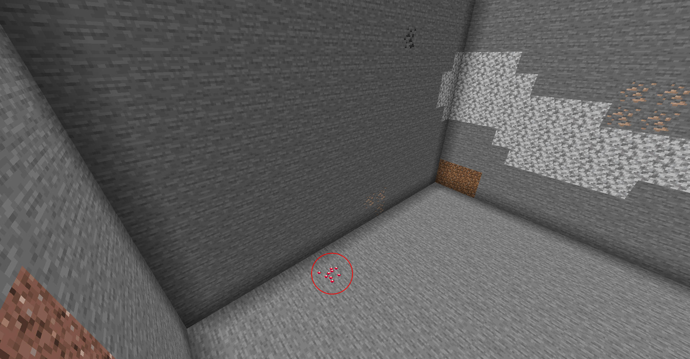

# Introduction to Features: Ore Generation
---

Ore Generation is a topic that doesn't deserve its own tutorial for. It's just a simple example for a much larger topic: `Feature`s. A `Feature` is how Minecraft populates the terrain after it generates. Anything from trees to lakes to veins is considered a `Feature`. In this tutorial, we will be talking about how to implement existing features into the game. Creating a feature will be reviewed in a later tutorial.

## <a name="features-at-a-glance"></a>Features at a Glance <a href="#features-at-a-glance"></a>
---

`Feature`s are created using two classes: the actual `Feature` and a configuration file. Each configuration file when registered is passed in via a `Codec`: basically a compmression/depcompression system to transfer data. All `Feature`s are specified with a configuration on use through `Feature::withConfiguration`. This returns a `ConfiguredFeature` allowing you to decide the placement of the feature via `ConfiguredFeature::withPlacement`. These will be the methods we use to create our specific ore generation.

### <a name="orefeature"></a>OreFeature <a href="#orefeature"></a>

`OreFeature` is the main class used to generate ores via `Feature::ORE`. It takes in a configuration file that specifies the target block type to replace, the state to replace it with, and the maximum size of the vein.

> Note: Although there are only three `FillerBlockType`s, you can create more using `FillerBlockType::create`. This is due to some use of ASM via `IExtensibleEnum` replaced at runtime.

Blocks will not generated above the specified height map so there will never be any 'floating' ores above ground.

The formula works well for ores with veins 6+. However, as it approaches a size of 1, the likelihood increases that the ores will not generate properly. In fact, the formula will almost never generates an ore with a vein size of 1. This is why emeralds are generated using a different and much simpler algorithm.

### <a name="replaceblockfeature"></a>ReplaceBlockFeature <a href="#replaceblockfeature"></a>

`ReplaceBlockFeature` is the class used to generate single ores via `Feature::EMERALD_ORE`. It takes in a configuration file of the block to replace and the state to replace it with. The formula is ridicously simple. It's just a check at the block position. If it returns true, then it places the block.

### <a name="countrange"></a>CountRange <a href="#countrange"></a>

`CountRange` is the placement class used to determine the initial block pos to start the generation from. It takes in the amount of times to generate in a chunk, the maximum gap in ore distance, the top offset, and the bottom offset.

### <a name="heightfourtothirtytwo"></a>Height4To32 <a href="#heightfourtothirtytwo"></a>

`Height4To32` is basically a `CountRange` that has been set to generate between heights 4 and 32. This takes in no configuration file. We will be using this to generate our ore.

### <a name="generationstage-decoration"></a>GenerationStage$Decoration <a href="#generationstage-decoration"></a>

The world is generated in stages. Each feature is designated to generate within a specific stage cycle. If you take a look inside the enum, I believe that the order they appear is how they are generated in the world. In our case, we will subscribe to `Decoration::UNDERGROUND_ORES` to generate our ores.

## <a name="application"></a>Application <a href="#application"></a>
---

To better support our range of feature generations in the future, I will specify three functions in a new class. The first will be to generate features in certain biomes, the second will be to generate features in all biomes except for the ones specified, and the third will be to generate features in all biomes. Since we also want to get every biome that is not ours, we will also create a static variable that gets initialized when we apply our generations to the biomes.

> Note: We do not include our own biomes as that should be handled internally. This is specifically for any biome that is not created by our mod.

```java
public class TutorialBiomeFeatures {

	private static Stream<Biome> biomes;
	
	public static void applyBiomeFeatures() {
		biomes = getDifferentBiomes();
	}
	
	protected static void generateFeatures(GenerationStage.Decoration stageIn, ConfiguredFeature<?, ?> featureIn, Biome... biomesIn) {
		for(Biome biome : biomesIn) biome.addFeature(stageIn, featureIn);
	}
	
	protected static void generateFeaturesExcept(GenerationStage.Decoration stageIn, ConfiguredFeature<?, ?> featureIn, Biome... biomesIn) {
		List<Biome> list = Lists.newArrayList(biomesIn);
		biomes.filter(biome -> !list.contains(biome)).forEach(biome -> biome.addFeature(stageIn, featureIn));
	}
	
	protected static void generateFeaturesInAllBiomes(GenerationStage.Decoration stageIn, ConfiguredFeature<?, ?> featureIn) {
		biomes.forEach(biome -> biome.addFeature(stageIn, featureIn));
	}
	
	private static Stream<Biome> getDifferentBiomes() {
		return ForgeRegistries.BIOMES.getValues().stream().filter(biome -> !biome.getRegistryName().getNamespace().equals(Tutorial.ID));
	}
}
```

> Note: Although parallel streams are possible, Minecraft is already not thread-safe in most cases, so it would serve no use.

In our case, I would like our ore to generate from levels 4 to 32, similar to ruby, but only in overworld biomes with a temperature of 2.0 (very hot). So, I will use the first method and input the desert and badlands biomes.

```java
public class TutorialBiomeFeatures {
	...
	public static void applyBiomeFeatures() {
		...
		generateFeatures(Decoration.UNDERGROUND_ORES, Feature.EMERALD_ORE.withConfiguration(new ReplaceBlockConfig(Blocks.STONE.getDefaultState(), TutorialBlocks.RUBY_ORE.get().getDefaultState())).withPlacement(Placement.EMERALD_ORE.configure(IPlacementConfig.NO_PLACEMENT_CONFIG)), Biomes.DESERT, Biomes.DESERT_HILLS, Biomes.DESERT_LAKES, Biomes.BADLANDS, Biomes.BADLANDS_PLATEAU, Biomes.ERODED_BADLANDS, Biomes.MODIFIED_BADLANDS_PLATEAU, Biomes.MODIFIED_WOODED_BADLANDS_PLATEAU, Biomes.WOODED_BADLANDS_PLATEAU);
	}
	...
}
```

> Note: Although `NoPlacementConfig` exists, any placement with no configuration should be called with `IPlacementConfig::NO_PLACEMENT_CONFIG`.

Now all we need to do is call `TutorialBiomeFeatures::applyBiomeFeatures` within our `FMLCommonSetupEvent`. Well, almost. I mentioned this as a note earlier, but Minecraft is not thread-safe in most cases. This means we can't go adding values into non-thread safe variables at any time. So, how do we go about this? Well, we stick the method within a `DeferredWorkQueue`. Using any of the four methods, we can schedule our methods to run at the end of a stage, allowing us to make sure that the code is now thread-safe.

```java
@SuppressWarnings("deprecation")
...
public class Tutorial {
	...
	private void commonSetup(final FMLCommonSetupEvent event) {
		DeferredWorkQueue.runLater(() -> {
			TutorialBiomeFeatures.applyBiomeFeatures();
		});
	}
	...
}
```

> Note: Although `DeferredWorkQueue` is deprecated, it should still be used. The deprecation refers to a new system currently being worked on. Until then, however, the current system will be used.

Now if we load up the game, we can fly to the generated biomes and systematically go through the chunk until we find our ore.



And as we can see, our ore is now generated!

---
All files are uploaded to the [GitHub](https://github.com/ChampionAsh5357/1.16.x-Minecraft-Tutorial/tree/1.16.1-32.0.61-web) under **Ore Generation**.

Back to [Blocks](./blocks)  
Back to [Basics](../../index#modding-101)  
Back to [Minecraft Tutorials](../../index)  