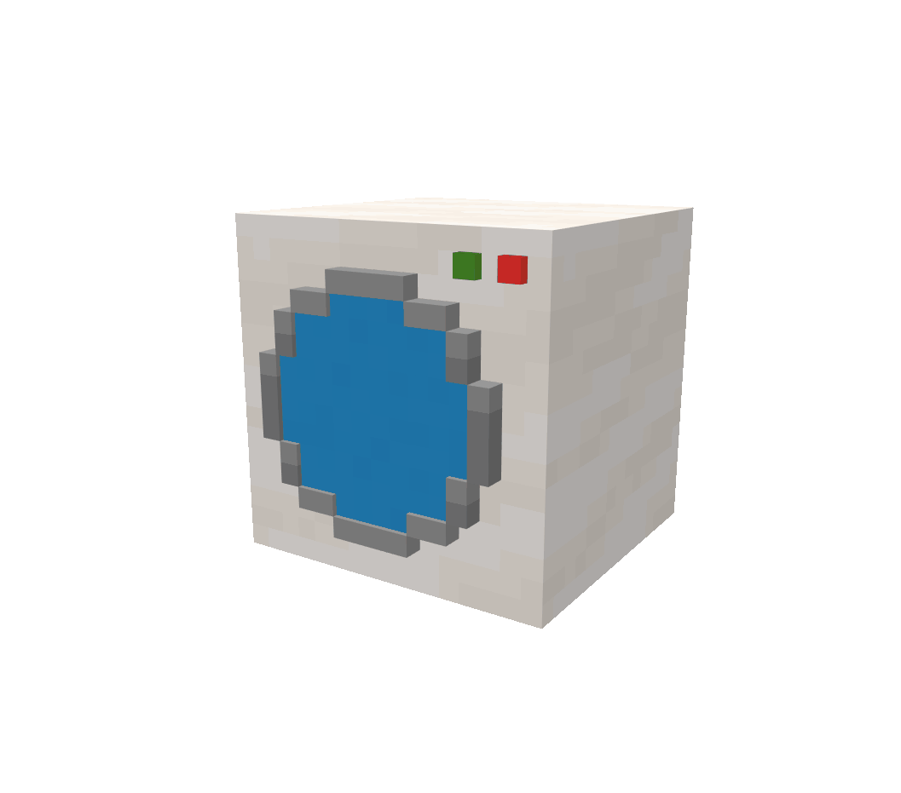
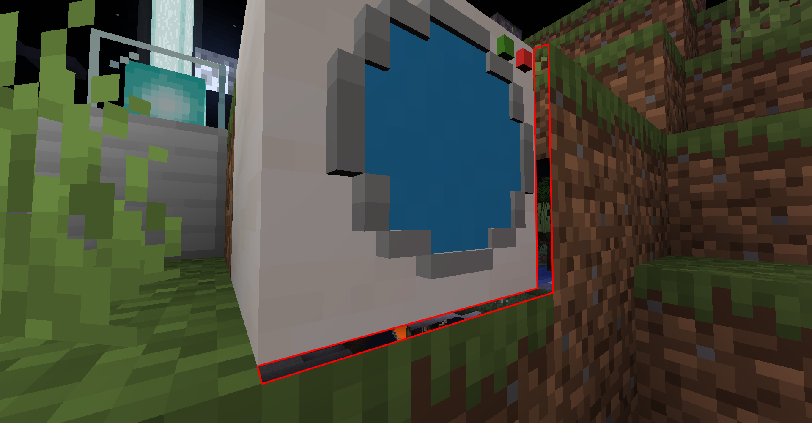
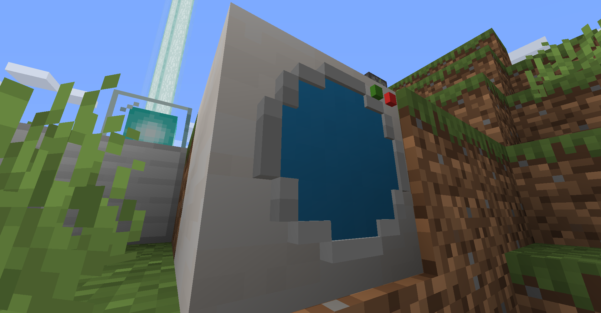

# <a name="blockstates"></a>BlockStates
---

When you create a block in the world, it is placed in a specific position at a specific point of time. The rotation, positioning, and look of the models can be determined by its current placement among its surrounding neighbors. This is what's known as a 'state'. For a default block in the game, a block only has a single state. However, if the block does not need to store complex information and can be updated dynamically by the methods in the class, a `BlockState` can be used and specified.

## <a name="properties"></a>Properties
---

To create a state in the game, a block must be given a `Property`. Properties define what state a block is currently in. There are four different classes that define property types: `IntegerProperty`, `BooleanProperty`, `DirectionProperty`, and `EnumProperty`. Anything that can't be represented by these properties most likely should not be implemented as a `BlockState`.

### <a name="integerproperty"></a>IntegerProperty

`IntegerProperty` creates a property that contains an integer value that can be between the set minimum and maximum bounds.

### <a name="booleanproperty"></a>BooleanProperty

`BooleanProperty` creates a property that creates a boolean value.

### <a name="enumproperty"></a>EnumProperty

`EnumProperty` creates a property that can be defined as any value in the specified enum.

### <a name="directionproperty"></a>DirectionProperty

`DirectionProperty` is a basic extension of `EnumProperty` specifically handled for rotation.

### <a name="blockstateproperties"></a>BlockStateProperties

`BlockStateProperties` is a class that holds a list of all defined properties within Minecraft. If you want to create a `Property`, you should check to see if it first exists within this class.

In our case, I will be implementing a basic washer that can be rotated in one of four directions. This can be best represented as a `DirectionProperty` defined in `BlockStateProperties` called `BlockStateProperties::HORIZONTAL_FACING`.



## <a name="block-class"></a>Block Class
---

So, let's create our default block class. We're just going to have it extend `Block`. Then we will declare a static final version of `BlockStateProperties::HORIZONTAL_FACING` within our class and the set the default state within the constructor via `StateHolder::with`.

```java
public class WasherBlock extends Block {

	public static final DirectionProperty FACING = BlockStateProperties.HORIZONTAL_FACING;
	
	public WasherBlock(Properties properties) {
		super(properties);
		this.setDefaultState(this.getStateContainer().getBaseState().with(FACING, Direction.NORTH));
	}
}
```

There are a few methods that are extremely important when dealing with `Blockstate`s. Although we won't be using all of them, I will still go over all the major ones.

Method | Parameter(s) | Use
`getStateForPlacement` | `BlockItemUseContext` context | Gets the state of the block when placed in the world.
`updatePostPlacement` | `BlockState` stateIn<br>`Direction` facing<br>`BlockState` facingState<br>`IWorld` worldIn<br>`BlockPos` currentPos<br>`BlockPos` facingPos | Updates the `BlockState` based on a neighbor changing.
`rotate` | `BlockState` state<br>`Rotation` rot | Rotates the `BlockState` if it has some sort of horizontal rotation.
`rotate` | `BlockState` state<br>`IWorld` world<br>`BlockPos` pos<br>`Rotation` direction | Rotates the `BlockState` if it has some sort of horizontal rotation. Although this method is added by Forge, this method is not currently implemented.
`mirror` | `BlockState` state<br>`Mirror` mirrorIn | Mirrors the `BlockState` if it has some sort of horizontal rotation.
`fillStateContainer` | `Builder<Block, BlockState>` builder | Adds properties to the `Block` so it can have a greater amount of `BlockState`s.

Since our block doesn't rely on its neighbors, we can implement every method but `AbstractBlock::updatePostPlacement`.

```java
public class WasherBlock extends Block {
	...
	@Override
	public BlockState getStateForPlacement(BlockItemUseContext context) {
		return this.getDefaultState().with(FACING, context.getPlacementHorizontalFacing().getOpposite());
	}
	
	@Override
	public BlockState rotate(BlockState state, IWorld world, BlockPos pos, Rotation direction) {
		return rotate(state, direction);
	}
	
	@Override
	public BlockState rotate(BlockState state, Rotation rot) {
		return state.with(FACING, rot.rotate(state.get(FACING)));
	}
	
	@Override
	public BlockState mirror(BlockState state, Mirror mirrorIn) {
		return rotate(state, mirrorIn.toRotation(state.get(FACING)));
	}
	
	@Override
	protected void fillStateContainer(Builder<Block, BlockState> builder) {
		builder.add(FACING);
	}
}
```

> Note: We place the block in the opposite direction we are facing so that the block is always facing us when placed.

From here, we need to [register](../basic/blocks#registry-setup) our block and add it to our [data generators](../../index#data-generators). I will add a few more methods here and there to better adapt to the situation, but I will not review them here. If you would like to, go look over the uploaded files.

However, as a mention, to get a `BlockState` to generate in rotations, you should use an implementation of `BlockStateProvider::horizontalBlock`.

So, now if we load up the game our block should be in it and rotating.



Well, there seems to be a slight issue with our block. Since I decided to make it not a full block, the box seems to be showing through the world. This has to do with how Minecraft rendering works. It assumes that a full block will not show any side of the blocks behind it, so it renders the side as invisible. The way to get around this is to fix our `VoxelShape` using `AbstractBlock::getShape`.

## <a name="collision-rotation"></a>Collision Rotation
---

Creating a collision box is simple. All we need to do is call `Block::makeCuboidShape` and then input it into `AbstractBlock::getShape`. If we needed a more complex shape, we could always use `VoxelShapes::or` to add a bunch of them together. But how would we rotate a collision box?

Well what is a collision box? Its a bunch of planes combined together. What about a plane? A collection of lines. And if we break that down to its simplest figure, we get a single point represented in three dimensions. So now comes the question, how do we rotate a three dimensional point? Now this is a question we can answer. We choose one of those dimensions to be the axis of rotation and rotate the points around that axis. Since we want the box to remain centered, we rotate the collision around the center of the box (0.5, 0.5, 0.5). We can easily decompose a [rotation matrix](https://en.wikipedia.org/wiki/Rotation_matrix) to suit our needs. Then all we need to do is offset the coordinates to (0, 0) before they are used and then reset them back to their original space after the calculation is complete.

I have broken this down into three classes `Coordinate` which holds a two-dimensional point, `Coordinate3d` which holds a three-dimensional point, and `RotationHelper` which rotates a `VoxelShape` using a conversion within the first two classes. I tried to reduce the computation power as much as possible. So, go take a look inside the code if you would like to use these three classes.

I also created a method called `RotationHelper::createYRotationMap` to make an easy call to create this rotational map for a horizontally changing block. From there, we just call it in our class and set the `VoxelShape`.

```java
public class WasherBlock extends Block {
	...
	public static final Map<Direction, VoxelShape> FACING_TO_SHAPE_MAP = RotationHelper.createYRotationMap(VoxelShapes.or(Block.makeCuboidShape(0, 0, 1, 16, 16, 16),
			Block.makeCuboidShape(6, 13, 0, 10, 14, 1),
			Block.makeCuboidShape(6, 2, 0, 10, 3, 1),
			Block.makeCuboidShape(13, 6, 0, 14, 10, 1),
			Block.makeCuboidShape(2, 6, 0, 3, 10, 1),
			Block.makeCuboidShape(3, 10, 0, 4, 12, 1),
			Block.makeCuboidShape(3, 4, 0, 4, 6, 1),
			Block.makeCuboidShape(12, 4, 0, 13, 6, 1),
			Block.makeCuboidShape(12, 10, 0, 13, 12, 1),
			Block.makeCuboidShape(10, 12, 0, 12, 13, 1),
			Block.makeCuboidShape(4, 12, 0, 6, 13, 1),
			Block.makeCuboidShape(10, 3, 0, 12, 4, 1),
			Block.makeCuboidShape(4, 3, 0, 6, 4, 1),
			Block.makeCuboidShape(3, 6, 0.25, 13, 10, 0.75),
			Block.makeCuboidShape(4, 10, 0.25, 12, 12, 0.75),
			Block.makeCuboidShape(4, 4, 0.25, 12, 6, 0.75),
			Block.makeCuboidShape(6, 3, 0.25, 10, 4, 0.75),
			Block.makeCuboidShape(6, 12, 0.25, 10, 13, 0.75),
			Block.makeCuboidShape(3, 14, 0.5, 4, 15, 1),
			Block.makeCuboidShape(1, 14, 0.5, 2, 15, 1)));
	...
	@Override
	public VoxelShape getShape(BlockState state, IBlockReader worldIn, BlockPos pos, ISelectionContext context) {
		return FACING_TO_SHAPE_MAP.get(state.get(FACING));
	}
	...
}
```

> Note: The reason why we statically initialize the rotational class is that we do not want to make the `VoxelShape` more than once. It heavily impacts game performance the more complex the shape is so we want to create or change the shape as little as possible.



And now we have our rotating block correctly rendering in the game!

---
All files are uploaded to the [GitHub](https://github.com/ChampionAsh5357/1.16.x-Minecraft-Tutorial/tree/1.16.1-32.0.61-web) under **BlockState**.

Review [Blocks](../basic/blocks)  
Back to [Block Extensions](../../index#block-extensions)  
Back to [Minecraft Tutorials](../../index)  