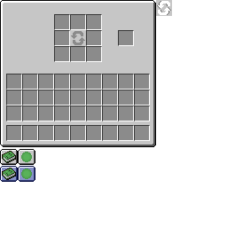

# Containers and Screens
---

Containers and screens are the way of handling gui information between the server and client. These are implemented on anything that can be accessed to hold data. If you haven't already, follow the washer line of tutorials to get to this point. Otherwise, you'll be completely lost as I go through this.

## <a name="containertype"></a>ContainerType <a href="#containertype"></a>

All containers are created and referenced through a `ContainerType` that takes in a generic of your current container. This will be [registered](../introduction/registries#deferredregister) and then passed to the server and client to stored and transfer information. All data will not be synced by default and will need to be sent depending on your situation. For now, let's worry about creating a basic `Container` class.

> Note: If we wanted to implement a recipe book helper, we would extend `RecipeBookContainer`. However, Forge has added no support for creating these types of containers/gui as of **32.0.75**. Therefore, we will be using a standard container.

```java
public class WasherContainer extends Container {

	public WasherContainer(ContainerType<?> type, int id) {
		super(type, id);
	}

	@Override
	public boolean canInteractWith(PlayerEntity playerIn) {
		return false;
	}

}
```

Now that we have the base in, let's try and create our `RegistryObject`. Looking at the constructor for `ContainerType`, we can see that it takes in a factory containing the current window id and the player inventory. So, if we want to be able to use a functional interface for this parameter, we must change our code to match it. In this case, we can pass in our `ContainerType` to our super method and add in a `PlayerInventory` parameter to allow us to pass in `WasherContainer::new`.

```java
public class WasherContainer extends Container {

	public WasherContainer(int id, PlayerInventory inventory) {
		super(TutorialContainerTypes.WASHER.get(), id);
	}
	...
}
```

```java
public class TutorialContainerTypes {
	...
	public static final RegistryObject<ContainerType<WasherContainer>> WASHER = CONTAINERS.register("washer", () -> new ContainerType<>(WasherContainer::new));
}
```

> Note: This is not a tutorial for Java. I will not be explaining how functional interfaces work with the double colon operator. Go read the [documentation](https://docs.oracle.com/javase/tutorial/java/javaOO/lambdaexpressions.html#approach6) provided by Oracle.

### <a name="container"></a>Container <a href="#container"></a>

A `Container` is probably the most important part to get right. There are a few methods to use when creating your container. I will go over the most of them. However, we will only be using a few since a lot of these will never be called.

Method | Use
--- | ---
`isWithinUsableDistance` | This method is **static**. Checks if the current container can be used within a certain distance. Should be referenced in `Container::canInteractWith` if container contains an `IWorldPosCallable`.
`assertIntArraySize` | This method is **static**. Check if you server and client `IIntArray` sizes match. There is an inventory implementation, but it is unused in our case.
`addSlot` | Adds an item slot to this container.
`trackInt` | Allows an integer to be synced between the client and server when changed.
`trackIntArray` | Allows an array of integers to be synced between the client and server when changed.
`addListener` | Adds a listener to sync client and server changes.
`removeListener` | This method is **client only**. Remove the given listener.
`getInventory` | Returns a list if `ItemStack`s.
`detectAndSendChanges` | Looks for changes made in the container.
`enchantItem` | Handles the given button-click on the server.
`getSlot` | Gets the current slot based on the id.
`transferStackInSlot` | Handle when the stack in slot is shift-clicked. Normally this moves the stack between the player inventory and the other inventory(s).
`slotClick` | Determines what action to do when the slot is clicked in some fashion.
`areItemsAndTagsEqual` | Checks if two `ItemStack`s are equal.
`canMergeSlot` | Called to determine if the current slot is valid for the stack merging (double-click) code. The stack passed in is null for the initial slot that was double-clicked.
`onContainerClosed` | Called when the container is closed.
`clearContainer` | Clears the current container of items and puts/drops them in the player's inventory.
`onCraftMatrixChanged` | Callback for when the crafting matrix is changed.
`putStackInSlot` | Puts an ItemStack in a slot.
`setAll` | This method is **client only**. Puts a list of items in the slots.
`updateProgressBar` | Updates the tracked integers.
`getNextTransactionID` | This method is **client only**. Gets the transaction id to use with the player.
`getCanCraft` | Gets whether or not the player can craft in this inventory or not.
`setCanCraft` | Sets whether the player can craft in this inventory or not.
`canInteractWith` | Determines whether supplied player can use this container.
`mergeItemStack` | Merges provided ItemStack with the first avaliable one in the container/player inventor between minIndex (included) and maxIndex (excluded).
`extractDragMode` | Extracts the drag mode.
`getDragEvent` | Gets the current drag event of the button.
`getQuickcraftMask` | This method is **client only**. Gets the data for screens to allow quick-crafting.
`isValidDragMode` | Checks if the drag mode is valid.
`resetDrag` | Reset the drag fields.
`canAddItemToSlot` | Checks if it's possible to add the given itemstack to the given slot.
`computeStackSize` | Compute the new stack size.
`canDragIntoSlot` | Returns true if the player can drag-spilt items into this slot.

> Note: Some of the methods not mentioned include an `IInventory` paramater which we cannot necessarily use. If you would like to reference them, grab your `ItemStackHandler` and wrap it using `RecipeWrapper`. This should give you an `IIventory` reference to use.

Later on, we will be getting extremely fancy with our code. This is just to supply the needed references for us to use for my vision of the final implementation. In this part, we will cover the minimum to get your code working. Later on, I will mention little details to spice up your programs.

Since our data is stored into an `ItemStackHandler`, we can pass that in as a parameter to register the indexes to appear on certain slots onscreen. In my case, I will be using the following as my gui texture.

<div style="text-align:center">

</div>

The separated slot will store the water container at index zero while the other eight slots are used to store the items to be washed. Although slots can define their location, their onscreen location is offseted by the left and top offsets provided in `Screen`. We can't just use `Container::addSlot` with a standard `Slot` interface. It only accepts an instance of `IIventory`. Instead, we will use `SlotItemHandler`.

Each slot takes in four parameters: the current inventory being referenced, the index, and the x and y coordinates of the slots location. All slots are 17x17 squares. However, they are represented usually as 18x18 on guis for extra design. To get the player inventory, we can just use the standard `Slot` reference. These slots will then be created in our constructor. As for how to determine the x and y coordinates, we can just go within our texture file and find the locations of all our drawn guis and apply. From there, we can do some math to make the process more algorithmic like so:

```java
public class WasherContainer extends Container {
	...
	public WasherContainer(int id, PlayerInventory playerInventory, ItemStackHandler inventory) {
		super(TutorialContainerTypes.WASHER.get(), id);

		this.addSlot(new SlotItemHandler(inventory, 0, 134, 35));
		
		boolean reg = false;
		for(int i = 0; i < 3; ++i) {
			for(int j = 0; j < 3; ++j) {
				if(!(i == 1 && j == 1)) this.addSlot(new SlotItemHandler(inventory, j + i * 3 + (reg ? 0 : 1), 62 + j * 18, 17 + i * 18));
				else reg = true;
			}
		}

		createPlayerInventory(playerInventory);
	}
	...
	private void createPlayerInventory(PlayerInventory playerInventory) {
		for(int y = 0; y < 3; ++y) {
			for(int x = 0; x < 9; ++x) {
				this.addSlot(new Slot(playerInventory, x + y * 9 + 9, 8 + x * 18, 84 + y * 18));
			}
		}
		
		for(int x = 0; x < 9; ++x) {
	         this.addSlot(new Slot(playerInventory, x, 8 + x * 18, 142));
	      }
	}
}
```

> Note: I make a method for player inventory since it will probably be reused the most. In most cases, you'll probably have an abstract class to extend that has this method.

Since we also need to have the method `Container::canInteractwith`, we can write a little bit of reusable code for our tile entities to use. Let's create a method that calculates if the player can open the container, pass it into the container as a `Function` that returns a boolean given a player, and apply the function within the method.

```java
private final Function<PlayerEntity, Boolean> interactFunction;
...
@Override
public boolean canInteractWith(PlayerEntity playerIn) {
	return interactFunction.apply(playerIn);
}
```

> Note: The function being passed in has been implemented in `ItemHandlerTileEntity` and overriden in `WasherTileEntity` for fancy implementations.

With this, we 'tehcnically' have our container implemented. The only difference is that almost all special functionality is non-existant and will probably crash our container if tried. To fix any crashes with shift-click, we need to override `Container::transferStackInSlot`. This will specify how our containers should merge its stacks between containers. The basic implementation of this class can be take from any container. The only thing you need to do is adjust the index variable to correctly match up with your slots. Slots are registered globally in the order you add them. So in our case, slot 0-8 is our inventory and slot 9-44 is the player inventory. We just have to try and merge the `ItemStack` from one group to the other.

```java
@Override
public ItemStack transferStackInSlot(PlayerEntity playerIn, int index) {
	ItemStack stack = ItemStack.EMPTY;
	Slot slot = this.inventorySlots.get(index);
	if(slot != null && slot.getHasStack()) {
		ItemStack stack1 = slot.getStack();
		stack = stack1.copy();
		if (index < 9) {
			if (!this.mergeItemStack(stack1, 9, 45, true)) {
				return ItemStack.EMPTY;
			}
		} else if (!this.mergeItemStack(stack1, 0, 9, false)) {
				return ItemStack.EMPTY;
       }

		if (stack1.isEmpty()) {
			slot.putStack(ItemStack.EMPTY);
		} else {
			slot.onSlotChanged();
		}

		if (stack1.getCount() == stack.getCount()) {
			return ItemStack.EMPTY;
		}

		slot.onTake(playerIn, stack1);
	}

	return stack;
}
```

This should fix any bugs that result from shift-clicking.

## <a name="screen"></a>Screen <a href="#screen"></a>

Now that we have created our container, we need to display it to the screen somehow. We can do this by creating a screen that displays our container. This is simply done by extending `ContainerScreen` and passing in our container like so:

```java
public class WasherScreen extends ContainerScreen<WasherContainer> {

	public WasherScreen(WasherContainer screenContainer, PlayerInventory inv, ITextComponent titleIn) {
		super(screenContainer, inv, titleIn);
	}

	@Override
	protected void func_230450_a_(MatrixStack p_230450_1_, float p_230450_2_, int p_230450_3_, int p_230450_4_) {}
}
```

There are many methods to go over in this class. However, we will only speak about a few for now.

Method | Use
--- | ---
`init` | Set any data you would like the screen to render.
`render` | Allows the screen to render.
`getBackgroundLayer (func_230450_a_)` | Creates the background associated with the screen.

Each of these are important in their own right. First, the background layer is how we display our GUI texture to the screen and any other animations. The render method allows us to attach the background gradient and tooltips to render as well. Finally, the initialization startup allows us to easily center strings that come with a `ContainerScreen`.

So how do we implement these methods? Well let's start with `init`. Within `init` there is a field called `field_238742_p_` that's used to set the location of the title string on the foreground. This is usually set to the screen size minus the font size divided by two.

```java
...
@Override
protected void init() {
	super.init();
	this.field_238742_p_ = (this.xSize - this.font.func_238414_a_(this.title)) / 2;
}
...
```

Next is `render`. In here we call two methods: one before the super method and one after. This is because when we render something new, it goes on top of anything already drawn to the screen. So we can render the background gradient first, the actual screen second, and the tooltips third to have them display correctly like so.

```java
@Override
public void render(MatrixStack stack, int x, int y, float partialTicks) {
	this.renderBackground(stack);
	super.render(stack, x, y, partialTicks);
	this.func_230459_a_(stack, x, y);
}
```

> Note: There are very few times where you won't implement this, so remeber to create this in all scenarios.

Finally we are left with `getBackgroundLayer (func_230450_a_)`. To be able to draw an image from a specific texture, we just need to bind it using `TextureManager::bindTexture` and draw it using `blit`. This method allows us to copy a bitmap (in this case our image) to another bitmap (in this case our screen). If you would like to do some more advanced drawings, you should look over `RenderSystem` and use the methods accordingly.

```java
@Override
protected void func_230450_a_(MatrixStack stack, float partialTicks, int x, int y) {
	this.minecraft.getTextureManager().bindTexture(GUI_TEXTURE);
	this.blit(stack, this.guiLeft, this.guiTop, 0, 0, this.xSize, this.ySize);
}
```

In this case, `GUI_TEXTURE` is our texture location (including extension) and `guiLeft`/`guiTop` is predefined variables determining where a gui should start to render on screen.

From here, all we need to do is to attach our gui to our container within our `FMLClientSetupEvent`:

```java
private void registerGuis() {
	ScreenManager.registerFactory(TutorialContainerTypes.WASHER.get(), WasherScreen::new);
}
```

> Note: `registerGuis` is called within my client setup. We can also use the double colon operator provided we don't add any new parameters to the main container, or create a separate constructor for them.

## <a name="interaction"></a>Interaction <a href="#interaction"></a>

To allow us to open our container, we need to implement an `INamedContainerProvider` and open it when our block is activated. We can implement this container anywhere, but the most accessible place would be our tile entity since we are passing data into it.

There are two methods we need to set for our container to be done. First `getDisplayName` is used to set the name of our container. This should be set to either a variable in your tile entity if nameable, a translation key if static, or `StringTextComponent::EMPTY` if unused.

```java
public class WasherTileEntity extends ItemHandlerTileEntity<ItemStackHandler> implements ITickableTileEntity, INamedContainerProvider {
=	...
	@Override
	public ITextComponent getDisplayName() {
		return TextTranslations.CONTAINER_WASHER;
	}	
}
```

Next is `createMenu`. Here is where we declare our full constructor to open. Do note that all information here is for the server and the client uses information stored in the defined `ContainerType`. All information that gets put into the server will either be synced via slot, reference holder, or some update format in the tile entity.

```java
@Override
public Container createMenu(int windowID, PlayerInventory inventory, PlayerEntity player) {
	return new WasherContainer(windowID, inventory, getInventory());
}
```

Then, all we need to do is to open the gui using `NetworkHooks::openGui` within our block using `AbstractBlock::onBlockActivated`. Remember, we open the container on the logical server. So, we need to make sure the world is not remote for this to happen.

```java
@Override
public ActionResultType onBlockActivated(BlockState state, World worldIn, BlockPos pos, PlayerEntity player, Hand handIn, BlockRayTraceResult hit) {
	TileEntity te = worldIn.getTileEntity(pos);
	if(te instanceof WasherTileEntity) {
		if(!worldIn.isRemote) {
				NetworkHooks.openGui((ServerPlayerEntity) player, (WasherTileEntity) te);
		}
		return ActionResultType.func_233537_a_(worldIn.isRemote);
	}
	return ActionResultType.PASS;
}
```

> Note: `ActionResultType::func_233537_a_` basically tells each side whether to declare it as successful or consume the item on the correct side. This should be called anytime functions result in tile entity information setting.

Now if you load up the game, you should now be able to see your container and store items in it!

## <a name="advanced_topics"></a>Advanced Topics <a href="#advanced-topics"></a>

If you go down and look at the github, you will probably notice how much is added compared to the above tutorial. This is because every program is unique in its regards to get something working. I'm not going to go over exactly how to do something since it wouldn't be much of a tutorial and more of here's the answer. I will, however, explain some of the techniques used.

When setting up `IntReferenceHolder`s, it is better to pass them in as a parameter from your tile entity rather than declaring directly in your container. This is because the container will create two separate instances (one for the client, the other for the server) and requires manual syncing. The tile entity will usually keep the holder synced allowing information from the server to be sent to the client. Remember to call `Container::trackInt` or `Container::trackIntArray` or else the data will never be synced.

On the screen side, we can add addition graphics on top of our already existing background using the same technique with a combination of reference holders. We can check the reference holders for a specific value and draw the corresponding image with its modified size to the screen. Do note, data is drawn from left to right, top to bottom. So, any information not passed in going in the correct direction will need a bit more finesse to render correctly.

Also on the screen side, we have `ContainerScreen::renderForegroundLayer (func_230451_b_)`. Information drawn here should be used as an overlay rather than an actual texture. This is why text and some tooltip handlers are set up here.

---
All files are uploaded to the [GitHub](https://github.com/ChampionAsh5357/1.16.x-Minecraft-Tutorial/tree/1.16.1-32.0.70-web) under **Containers and Screens**.
  
Back to [Intermediates](../../index#modding-202)  
Back to [Minecraft Tutorials](../../index)  