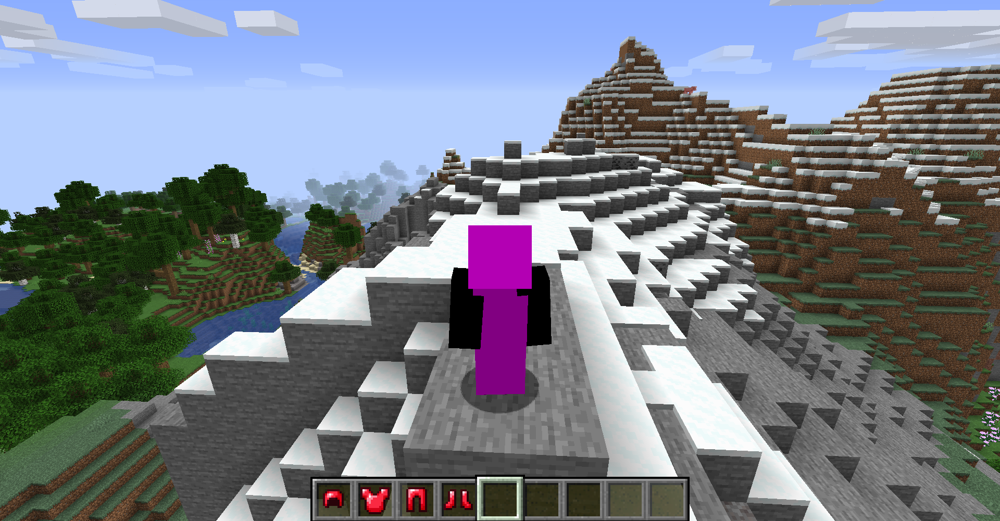
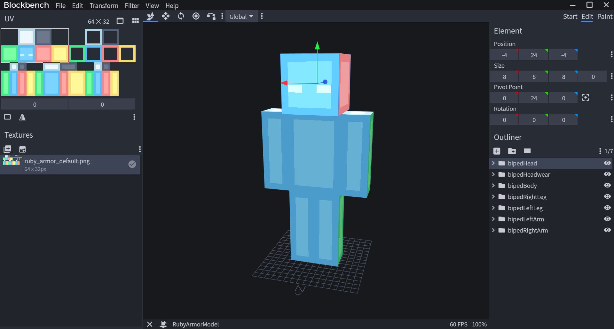
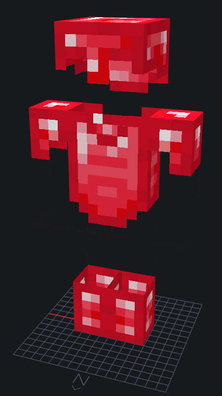
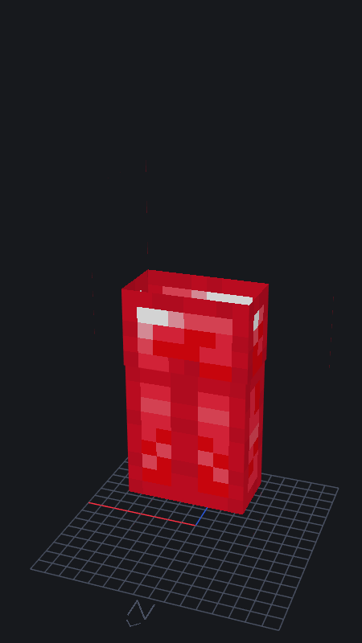
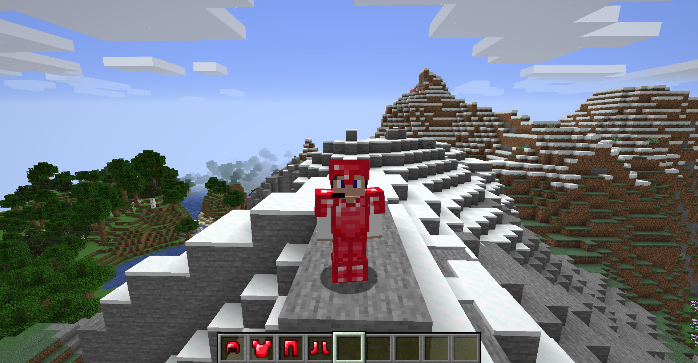
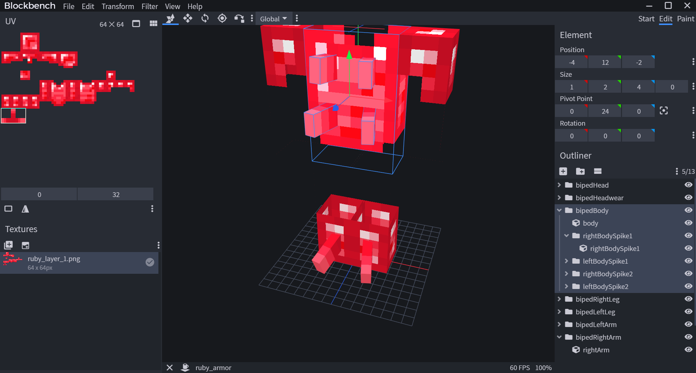
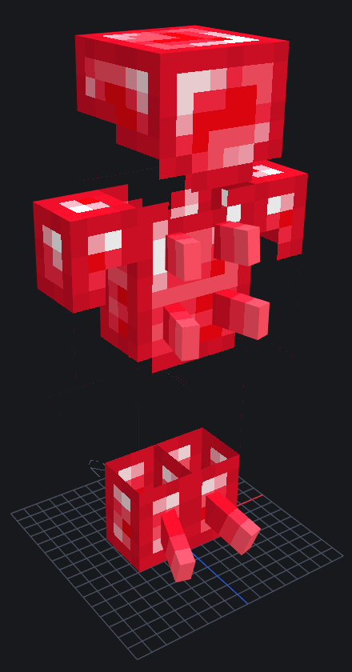
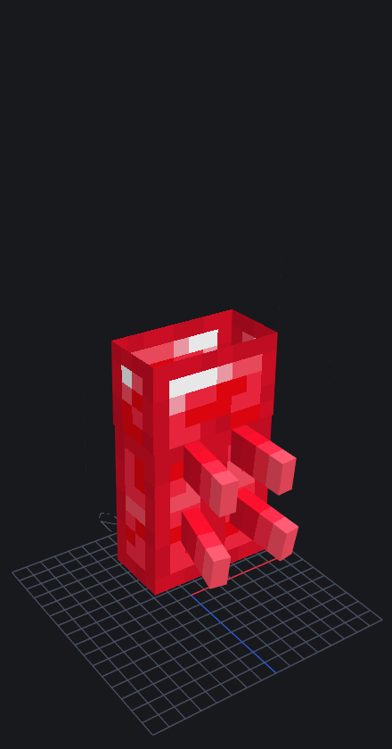
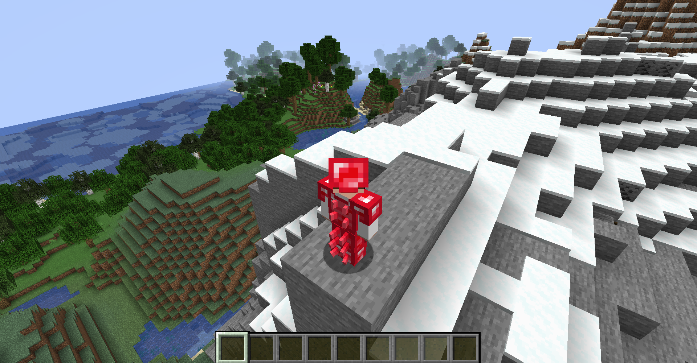

# Armor
---

Hello warriors of the west! Welcome to your introduction to creating custom armor within Minecraft. In this tutorial, we will be going over a basic implementation of armor as well as how to customize your model to the fullest.

## <a name="registry-setup"></a>Registry Setup <a href="#registry-setup"></a>
---

Let's first go over how we are going to create our custom armor. Since our example `Item` was ruby, we will use for this example **ruby armor**.

<div style="text-align:center">


</div>

### <a name="iarmormaterial"></a>IArmorMaterial <a href="#iarmormaterial"></a>

All `ArmorItem`s take in an interface known as `IArmorMaterial`. This holds all stats about the armor from its enchantability to its durability to its repair material. By vanilla standards, `IArmorMaterial` is implemented on the enum `ArmorMaterial` and called from there. Although the enum is not extensible, there is no specific case where `ArmorMaterial` is cast to the code. This allows us to create our own enum `TutorialArmorMaterial` that implements `IArmorMaterial`:

```java
public enum TutorialArmorMaterial implements IArmorMaterial {
	;

	@Override
	public int getDurability(EquipmentSlotType slotIn) {
		return 0;
	}

	@Override
	public int getDamageReductionAmount(EquipmentSlotType slotIn) {
		return 0;
	}

	@Override
	public int getEnchantability() {
		return 0;
	}

	@Override
	public SoundEvent getSoundEvent() {
		return null;
	}

	@Override
	public Ingredient getRepairMaterial() {
		return null;
	}

	@Override
	public String getName() {
		return null;
	}

	@Override
	public float getToughness() {
		return 0;
	}

	@Override
	public float func_230304_f_() {
		return 0;
	}
}
```

Here is a quick overiew of all the functions in `IArmorMaterial`:

Method | Parameter(s) | Return Type | Use
--- | :---: | :---: | ---
`getDurability` | `EquipmentSlotType` slotIn | `int` | Returns the durability of the material specific to the equipment slot.
`getDamageReductionAmount` | `EquipmentSlotType` slotIn | `int` | Returns the damage mitigated specific to the equipment slot.
`getEnchantability` | NONE | `int` | Returns the enchantability of the material.
`getSoundEvent` | NONE | `SoundEvent` | Returns the equip sound of the material.
`getRepairMaterial` | NONE | `Ingredient` | Returns the repair material(s) of the material. This depends on how many `Item`s are passed into the `Ingredient` static intiailizer.
`getName` | NONE | `String` | Returns the name associated with the location of the `ArmorItem` texture. For example, if the method returned `domain:location`, this would map to `domain:textures/models/armor/location_layer_(1/2).png`.
`getToughness` | NONE | `float` | Returns the toughness of the material.
`getKnockbackResistance (func_230304_f_)` | NONE | `float` | Returns the knockback resistance of the material.

> Note: Minecraft uses a integer array to calculate its durability to use consistent ratios. This can be located at `ArmorMaterial::MAX_DAMAGE_ARRAY`.

Since we will be using most of Minecraft's code (with some small changes in name mappings and class usage), we can just copy it over:

```java
package io.github.championash5357.tutorial.item;

import java.util.function.Supplier;

import net.minecraft.inventory.EquipmentSlotType;
import net.minecraft.item.IArmorMaterial;
import net.minecraft.item.crafting.Ingredient;
import net.minecraft.util.SoundEvent;
import net.minecraftforge.api.distmarker.Dist;
import net.minecraftforge.api.distmarker.OnlyIn;
import net.minecraftforge.common.util.Lazy;

public enum TutorialArmorMaterial implements IArmorMaterial {
	;

	private static final int[] MAX_DAMAGE_ARRAY = new int[]{13, 15, 16, 11};
	private final String name;
	private final int maxDamageFactor;
	private final int[] damageReductionAmountArray;
	private final int enchantability;
	private final SoundEvent soundEvent;
	private final float toughness;
	private final float knockbackResistance;
	private final Lazy<Ingredient> repairMaterialLazy;

	private TutorialArmorMaterial(String nameIn, int maxDamageFactorIn, int[] damageReductionAmountArrayIn, int enchantabilityIn, SoundEvent soundEventIn, float toughnessIn, float knockbackResistanceIn, Supplier<Ingredient> repairMaterialSupplier) {
		this.name = Tutorial.ID + ":" + nameIn;
		this.maxDamageFactor = maxDamageFactorIn;
		this.damageReductionAmountArray = damageReductionAmountArrayIn;
		this.enchantability = enchantabilityIn;
		this.soundEvent = soundEventIn;
		this.toughness = toughnessIn;
		this.knockbackResistance = knockbackResistanceIn;
		this.repairMaterialLazy = Lazy.concurrentOf(repairMaterialSupplier);
	}

	@Override
	public int getDurability(EquipmentSlotType slotIn) {
		return MAX_DAMAGE_ARRAY[slotIn.getIndex()] * this.maxDamageFactor;
	}

	@Override
	public int getDamageReductionAmount(EquipmentSlotType slotIn) {
		return this.damageReductionAmountArray[slotIn.getIndex()];
	}

	@Override
	public int getEnchantability() {
		return this.enchantability;
	}

	@Override
	public SoundEvent getSoundEvent() {
		return this.soundEvent;
	}

	@Override
	public Ingredient getRepairMaterial() {
		return this.repairMaterialLazy.get();
	}

	@OnlyIn(Dist.CLIENT)
	public String getName() {
		return this.name;
	}

	@Override
	public float getToughness() {
		return this.toughness;
	}

	@Override
	public float func_230304_f_() {
		return this.knockbackResistance;
	}
}
```

> Note: The main changes occur in `ArmorMaterial::field_234660_o_` being renamed to `TutorialArmorMaterial::knockbackResistance` and `LazyValue<Ingredient>` being replaced with `Lazy<Ingredient>` and `Lazy::concurrentOf` to make the implementation [thread-safe](https://www.baeldung.com/java-thread-safety).

From there, all we have to do is define our armor using our constructor. In our example, I am going to make our ruby armor sit between iron and diamond with some minor benefits such as increased enchantability.

While I implement this, here's a breakdown of the constructor:

Variable | Type | Use
--- | :---: | ---
nameIn | `String` | The name of the material.
maxDamageFactorIn | `int` | The durability factor of the material.
damageReductionAmountArrayIn | `int[]` | The damage mitigation amount starting from `EquipmentSlotType::FEET` and going to `EquipmentSlotType::HEAD`.
enchantabilityIn | `int` | The enchantability of the material.
soundEventIn | `SoundEvent` | The equip sound of the material.
toughnessIn | `float` | The toughness of the material.
knockbackResistanceIn | `float` | The knockback resistance of the material.
repairMaterialSupplier | `Supplier<Ingredient>` | A supplier holding the repair `Item`(s) of the material.

> Note: When we pass in the name of the material, we prefix it with our mod id and a colon. This is so that our armor model is found in the correct location.

```java
public enum TutorialArmorMaterial implements IArmorMaterial {
	RUBY("ruby", 30, new int[] {2, 6, 7, 3}, 15, SoundEvents.ITEM_ARMOR_EQUIP_GENERIC, 1.0F, 0.0F, () -> Ingredient.fromItems(TutorialItems.RUBY.get()));
	...
}
```

### <a name="item-registry"></a>Item Registry <a href="#item-registry"></a>

From here, we are now able to register our item once again using our [DeferredRegister](../basic/items#registry-setup). We will create an item for each `EquipmentSlotType` (`HEAD`, `CHEST`, `LEGS`, `FEET`) and group them within `ItemGroup::COMBAT`.

```java
public class TutorialItems {
	...
	public static final RegistryObject<ArmorItem> RUBY_HELMET = ITEMS.register("ruby_helmet", () -> new ArmorItem(TutorialArmorMaterial.RUBY, EquipmentSlotType.HEAD, new Item.Properties().group(ItemGroup.COMBAT)));
	public static final RegistryObject<ArmorItem> RUBY_CHESTPLATE = ITEMS.register("ruby_chestplate", () -> new ArmorItem(TutorialArmorMaterial.RUBY, EquipmentSlotType.CHEST, new Item.Properties().group(ItemGroup.COMBAT)));
	public static final RegistryObject<ArmorItem> RUBY_LEGGINGS = ITEMS.register("ruby_leggings", () -> new ArmorItem(TutorialArmorMaterial.RUBY, EquipmentSlotType.LEGS, new Item.Properties().group(ItemGroup.COMBAT)));
	public static final RegistryObject<ArmorItem> RUBY_BOOTS = ITEMS.register("ruby_boots", () -> new ArmorItem(TutorialArmorMaterial.RUBY, EquipmentSlotType.FEET, new Item.Properties().group(ItemGroup.COMBAT)));
}
```

From there all we need to is setup our [resources](../basic/items#resource-setup) and viola our armor should be in the game, right?



Well everything seems to be rendering...except for, you know, the armor model. This is because armor models aren't handled by a simple texture, but are rather a layer applied via a `BipedArmorLayer` and texture using an `BipedModel` format.

## <a name="extra-resouces"></a>Extra Resources <a href="#extra-resouces"></a>
---

So, now we neeed to create the `BipedModel` textures for our `ArmorItem`.

### <a name="armor-layer-1-and-2"></a>Armor Layer 1 and 2 <a href="#"></a>


All armor model textures has four layers: `armor_layer_1`, `armor_layer_2`, `armor_layer_1_overlay`, and `armor_layer_2_overlay`. Layer 1 is scaled normally and usually holds the head, chest, and feet textures. Layer 2 is scaled to half size and usually holds the legs texture. Layer 1 and Layer 2 are always rendered with the default `BipedModel`. Layer 1 Overlay and Layer 2 Overlay are only rendered if the `ArmorItem` used is implemented with `IDyeableArmorItem`. These two are usually used for rendering dynamic color on the armor model.

To be able to create our armor textures, we are going to need to edit a `BipedModel`texture. Now you can use any texture editor you want. However, for a better visualization, I will be using [Blockbench](https://blockbench.net/) to show off these textures on a model.

Currently, I am going to edit the skin of a zombie. A zombie uses the standard `BipedModel` allowing us to do a direct trace of the entity to an armor model. Opening up the program and doing the configurations (opening the `Skin` tab, setting the model to `Zombie` at `16x`, adjusting the model to correctly represent the `BipedModel` class) gives me this:



From here I can paint my textures directly into the program and see the result. Since I want to keep the continuity of Minecraft's armor setup, I will just use the default Layer 1 and Layer 2 setup and adjust accordingly. Using this, I can create my armor textures:

<div style="text-align:center">


</div>

<div style="text-align:center">


</div>

To get these textures to render on the model, I need to save them as `material_layer_1.png` and `material_layer_2.png` where material is our `IArmorMaterial` name (e.g. `ruby`). Since they are not technically items nor entities, they have their own special location to be saved. So let's once again open up our file tree all the way down to `assets/tutorial/textures`:

```
assets/tutorial/textures
└── item
```

We need to add a new subdirectory `models/armor` and save our two textures in there.

```
assets/tutorial/textures
├── item
└── models
	└── armor
		├── ruby_layer_1.png
		└── ruby_layer_2.png
```

Now if we go back into the game, we should see our model fully loaded on our player.



And now we have our armor within the game!

## <a name="custom-armor-model"></a>Custom Armor Model <a href="#custom-armor-model"></a>
---

Custom Armor Models are one of the more difficult things to implement due to a lack of understanding and consistency between programmers. Today, I will attempt my best explanation of how to correctly implement and create a custom armor model for your player. Child Models are by far the most popular method in rendering an armor model in Minecraft. However, the amount of detail required to correctly render one takes a bit of detail and effort.

### <a name="armor-model"></a>Armor Model <a href="#armor-model"></a>

First, let's create our custom model. I'm going to build it off our ruby armor and just add some spikes coming out of the back of the armor. I will be using [Blockbench](https://blockbench.net/) once again for this.

There are a few things that you need to consider when creating your model:  
**Box Size** - This is one of the biggest issues I see when people include custom models. They just add boxes and dont necessarily think of the consequences. Whenever you add a box into the game, if the number isn't an integer, then the texture will scale up to the size required to correct the ratio discrepency. So, if I had a box with the dimensions of 1, 1, and 1.5. From the standard texture of 64x32, I would need a texture of 128x64 to correctly render my box. Box sizes of 0 also are an issue as they just don't exist. A box dimension must be at least 0.005 to correctly render on the screen with no flickering.  
**Box Position** - Just because they are floats doesn't mean you can you can a position of 1.4348927f. After a certain point the model movement will show absolutely nothing. Please try to stick with a precision of at most 0.001f.  
**ModelRenderer Sanity** - There are two major distinctions of `ModelRenderer`s in Minecraft: Global `ModelRenderer`s and Local `ModelRenderer`s. In any example where your `ModelRenderer` is becoming a child, it should be a local `ModelRenderer`. Local `ModelRenderer`s are inaccessible outside of the constructor. However, since they inherit all their traits from the parent, it makes absolutely no difference since the data will be copied corresponding to its parent. In the case of Global `ModelRenderer`s, they should never be put as a child. In that case, copy the model angles of the part you want to mimic and then supply it in either `AgeableModel::getHeadParts` or `AgeableModel::getBodyParts` where applicable. There should be absolutely no reason to touch `Model::render` **AT ALL**. We must make sure that every box or `ModelRenderer` we create that they are always are in a sub directory of one of `BipedModel`'s `ModelRenderer`s.



As you can see, each folder represents a `ModelRenderer` while each cube represents a box. All of my added data is within a subdirectory of one of `BipedModel`'s `ModelRenderer`s.  

> Note: Due to how armor models are called, global `ModelRenderer`s should never be used. They will be called incorrectly and never map to the player's rotation.

**Texture Information** - If you decide to change the texture size for you model, please pay close attention. In respect to the set texture width and size, the first 64x32 pixels starting at the top left corner are reserved for the `BipedModel` `ModelRenderer`s. If you decide to add any extra texture data, make sure it is not within those bounds or else you will render some of your custom texture on the default `BipedModel`. Your default texture size will have to be larger than 64x32 if you would like to render any other texture to your model.  
**EquipmentSlotType Sanity** - As mentioned [previously](#armor-layer-1-and-2), the legs are rendered at half size compared to the rest of the model. If you add anything specifically for the legs, you do need to take this into consideration and create the model separately. Of course, you could always go the one size fits all route, but then you would lose the point of having two layers for the armor.

From there, you can export your [textures](#armor-layer-1-and-2) and the completed model. Make sure you name the textures `material_layer_(1/2).png` where material is your `IArmorMaterial` in `textures/models/armor`. 

<div style="text-align:center">


</div>

<div style="text-align:center">


</div>

Your model class will be saved to your client folder. Since I prefer to model my files similar to Minecraft, I will store my armor file as `RubyArmorModel` in `client.renderer.entity.model`.

```
src/main/java/io/github/championash5357/tutorial/client
├── client
│	└── renderer
│		└── entity
│			└── model
│				└── RubyArmorModel.java
├── init
├── item
├── server
└── Tutorial.java
```

### <a name="model-class-cleanup"></a>Model Class Cleanup <a href="#model-class-cleanup"></a>

Now we have a current model class that looks something similar to this:

```java
public class RubyArmorModel extends EntityModel<Entity> {
	private final ModelRenderer bipedHead;
	private final ModelRenderer bipedHeadwear;
	private final ModelRenderer bipedBody;
	private final ModelRenderer rightBodySpike1;
	private final ModelRenderer leftBodySpike1;
	private final ModelRenderer rightBodySpike2;
	private final ModelRenderer leftBodySpike2;
	private final ModelRenderer bipedRightLeg;
	private final ModelRenderer rightBootSpike;
	private final ModelRenderer rightLegSpike1;
	private final ModelRenderer rightLegSpike2;
	private final ModelRenderer bipedLeftLeg;
	private final ModelRenderer leftBootSpike;
	private final ModelRenderer leftLegSpike1;
	private final ModelRenderer leftLegSpike2;
	private final ModelRenderer bipedLeftArm;
	private final ModelRenderer bipedRightArm;

	public RubyArmorModel() {
		textureWidth = 64;
		textureHeight = 64;

		bipedHead = new ModelRenderer(this);
		bipedHead.setRotationPoint(0.0F, 0.0F, 0.0F);
		bipedHead.setTextureOffset(0, 0).addBox(-4.0F, -8.0F, -4.0F, 8.0F, 8.0F, 8.0F, 0.0F, false);

		bipedHeadwear = new ModelRenderer(this);
		bipedHeadwear.setRotationPoint(0.0F, 24.0F, 0.0F);
		bipedHeadwear.setTextureOffset(32, 0).addBox(-4.0F, -32.0F, -4.0F, 8.0F, 8.0F, 8.0F, 0.5F, false);

		bipedBody = new ModelRenderer(this);
		bipedBody.setRotationPoint(0.0F, 0.0F, 0.0F);
		bipedBody.setTextureOffset(16, 16).addBox(-4.0F, 0.0F, -2.0F, 8.0F, 12.0F, 4.0F, 0.0F, false);

		rightBodySpike1 = new ModelRenderer(this);
		rightBodySpike1.setRotationPoint(-2.0F, 22.0F, 1.0F);
		bipedBody.addChild(rightBodySpike1);
		setRotationAngle(rightBodySpike1, 0.0F, -0.2618F, 0.0F);
		rightBodySpike1.setTextureOffset(0, 32).addBox(0.0F, -16.0F, 0.0F, 1.0F, 2.0F, 4.0F, 0.0F, false);

		leftBodySpike1 = new ModelRenderer(this);
		leftBodySpike1.setRotationPoint(2.0F, 22.0F, 1.0F);
		bipedBody.addChild(leftBodySpike1);
		setRotationAngle(leftBodySpike1, 0.0F, 0.2618F, 0.0F);
		leftBodySpike1.setTextureOffset(0, 32).addBox(-1.0F, -16.0F, 0.0F, 1.0F, 2.0F, 4.0F, 0.0F, false);

		rightBodySpike2 = new ModelRenderer(this);
		rightBodySpike2.setRotationPoint(-2.0F, 22.0F, 1.0F);
		bipedBody.addChild(rightBodySpike2);
		setRotationAngle(rightBodySpike2, 0.0873F, -0.1745F, 0.0F);
		rightBodySpike2.setTextureOffset(0, 32).addBox(0.0F, -20.0F, 1.0F, 1.0F, 2.0F, 4.0F, 0.0F, false);

		leftBodySpike2 = new ModelRenderer(this);
		leftBodySpike2.setRotationPoint(2.0F, 22.0F, 1.0F);
		bipedBody.addChild(leftBodySpike2);
		setRotationAngle(leftBodySpike2, 0.0873F, 0.1745F, 0.0F);
		leftBodySpike2.setTextureOffset(0, 32).addBox(-1.0F, -20.0F, 1.0F, 1.0F, 2.0F, 4.0F, 0.0F, false);

		bipedRightLeg = new ModelRenderer(this);
		bipedRightLeg.setRotationPoint(-1.9F, 12.0F, 0.0F);
		bipedRightLeg.setTextureOffset(0, 16).addBox(-2.0F, 0.0F, -2.0F, 4.0F, 12.0F, 4.0F, 0.0F, false);

		rightBootSpike = new ModelRenderer(this);
		rightBootSpike.setRotationPoint(-0.1F, 10.0F, 1.0F);
		bipedRightLeg.addChild(rightBootSpike);
		setRotationAngle(rightBootSpike, -0.3491F, -0.2618F, 0.0F);
		rightBootSpike.setTextureOffset(0, 32).addBox(0.0F, -2.0F, 0.0F, 1.0F, 2.0F, 4.0F, 0.0F, false);

		rightLegSpike1 = new ModelRenderer(this);
		rightLegSpike1.setRotationPoint(-0.1F, 10.0F, 1.0F);
		bipedRightLeg.addChild(rightLegSpike1);
		setRotationAngle(rightLegSpike1, -0.1745F, -0.1745F, 0.0F);
		rightLegSpike1.setTextureOffset(10, 32).addBox(0.0F, -6.0F, 0.0F, 1.0F, 2.0F, 4.0F, 0.0F, false);

		rightLegSpike2 = new ModelRenderer(this);
		rightLegSpike2.setRotationPoint(-0.1F, 10.0F, 1.0F);
		bipedRightLeg.addChild(rightLegSpike2);
		setRotationAngle(rightLegSpike2, -0.0873F, -0.0873F, 0.0F);
		rightLegSpike2.setTextureOffset(10, 32).addBox(0.0F, -10.0F, 0.0F, 1.0F, 2.0F, 4.0F, 0.0F, false);

		bipedLeftLeg = new ModelRenderer(this);
		bipedLeftLeg.setRotationPoint(1.9F, 12.0F, 0.0F);
		bipedLeftLeg.setTextureOffset(0, 16).addBox(-2.0F, 0.0F, -2.0F, 4.0F, 12.0F, 4.0F, 0.0F, true);

		leftBootSpike = new ModelRenderer(this);
		leftBootSpike.setRotationPoint(0.1F, 10.0F, 1.0F);
		bipedLeftLeg.addChild(leftBootSpike);
		setRotationAngle(leftBootSpike, -0.3491F, 0.2618F, 0.0F);
		leftBootSpike.setTextureOffset(0, 32).addBox(-1.0F, -2.0F, 0.0F, 1.0F, 2.0F, 4.0F, 0.0F, false);

		leftLegSpike1 = new ModelRenderer(this);
		leftLegSpike1.setRotationPoint(0.1F, 10.0F, 1.0F);
		bipedLeftLeg.addChild(leftLegSpike1);
		setRotationAngle(leftLegSpike1, -0.1745F, 0.1745F, 0.0F);
		leftLegSpike1.setTextureOffset(10, 32).addBox(-1.0F, -6.0F, 0.0F, 1.0F, 2.0F, 4.0F, 0.0F, false);

		leftLegSpike2 = new ModelRenderer(this);
		leftLegSpike2.setRotationPoint(0.1F, 10.0F, 1.0F);
		bipedLeftLeg.addChild(leftLegSpike2);
		setRotationAngle(leftLegSpike2, -0.0873F, 0.0873F, 0.0F);
		leftLegSpike2.setTextureOffset(10, 32).addBox(-1.0F, -10.0F, 0.0F, 1.0F, 2.0F, 4.0F, 0.0F, false);

		bipedLeftArm = new ModelRenderer(this);
		bipedLeftArm.setRotationPoint(5.0F, 2.0F, 0.0F);
		bipedLeftArm.setTextureOffset(40, 16).addBox(-1.0F, -2.0F, -2.0F, 4.0F, 12.0F, 4.0F, 0.0F, true);

		bipedRightArm = new ModelRenderer(this);
		bipedRightArm.setRotationPoint(-5.0F, 2.0F, 0.0F);
		bipedRightArm.setTextureOffset(40, 16).addBox(-3.0F, -2.0F, -2.0F, 4.0F, 12.0F, 4.0F, 0.0F, false);
	}

	@Override
	public void setRotationAngles(Entity entity, float limbSwing, float limbSwingAmount, float ageInTicks, float netHeadYaw, float headPitch){
		//previously the render function, render code was moved to a method below
	}

	@Override
	public void render(MatrixStack matrixStack, IVertexBuilder buffer, int packedLight, int packedOverlay, float red, float green, float blue, float alpha){
		bipedHead.render(matrixStack, buffer, packedLight, packedOverlay);
		bipedHeadwear.render(matrixStack, buffer, packedLight, packedOverlay);
		bipedBody.render(matrixStack, buffer, packedLight, packedOverlay);
		bipedRightLeg.render(matrixStack, buffer, packedLight, packedOverlay);
		bipedLeftLeg.render(matrixStack, buffer, packedLight, packedOverlay);
		bipedLeftArm.render(matrixStack, buffer, packedLight, packedOverlay);
		bipedRightArm.render(matrixStack, buffer, packedLight, packedOverlay);
	}

	public void setRotationAngle(ModelRenderer modelRenderer, float x, float y, float z) {
		modelRenderer.rotateAngleX = x;
		modelRenderer.rotateAngleY = y;
		modelRenderer.rotateAngleZ = z;
	}
}
```

It's just a massive mess. So let's clean it up. First, we can remove `Model::render` and `EntityModel::setRotationAngles` since all our fields will be local and will be relative to the parent its attached to. Next, we can change the extension type to `BipedModel<LivingEntity>`. We also have to fix our constructor to take a `float modelSize` and call its `super`. After that, we can remove all instances of `biped...` within our file. They were used as temporary fields to organize. However, now, they will reference the actual fields within `BipedModel`. We should also add our package declaration to the right location. Finally, make all your `ModelRenderer` fields local so that they cannot be accessed outside the constructor. This part mainly adds sanity as we don't want to call any child without their parent. This should leave your model looking something like this:

```java
public class RubyArmorModel extends BipedModel<LivingEntity> {

	public RubyArmorModel(float modelSize) {
		super(modelSize, 0.0F, 64, 64);

		ModelRenderer rightBodySpike1 = new ModelRenderer(this);
		rightBodySpike1.setRotationPoint(-2.0F, 22.0F, 1.0F);
		bipedBody.addChild(rightBodySpike1);
		setRotationAngle(rightBodySpike1, 0.0F, -0.2618F, 0.0F);
		rightBodySpike1.setTextureOffset(0, 32).addBox(0.0F, -16.0F, 0.0F, 1.0F, 2.0F, 4.0F, 0.0F, false);

		ModelRenderer leftBodySpike1 = new ModelRenderer(this);
		leftBodySpike1.setRotationPoint(2.0F, 22.0F, 1.0F);
		bipedBody.addChild(leftBodySpike1);
		setRotationAngle(leftBodySpike1, 0.0F, 0.2618F, 0.0F);
		leftBodySpike1.setTextureOffset(0, 32).addBox(-1.0F, -16.0F, 0.0F, 1.0F, 2.0F, 4.0F, 0.0F, false);

		ModelRenderer rightBodySpike2 = new ModelRenderer(this);
		rightBodySpike2.setRotationPoint(-2.0F, 22.0F, 1.0F);
		bipedBody.addChild(rightBodySpike2);
		setRotationAngle(rightBodySpike2, 0.0873F, -0.1745F, 0.0F);
		rightBodySpike2.setTextureOffset(0, 32).addBox(0.0F, -20.0F, 1.0F, 1.0F, 2.0F, 4.0F, 0.0F, false);

		ModelRenderer leftBodySpike2 = new ModelRenderer(this);
		leftBodySpike2.setRotationPoint(2.0F, 22.0F, 1.0F);
		bipedBody.addChild(leftBodySpike2);
		setRotationAngle(leftBodySpike2, 0.0873F, 0.1745F, 0.0F);
		leftBodySpike2.setTextureOffset(0, 32).addBox(-1.0F, -20.0F, 1.0F, 1.0F, 2.0F, 4.0F, 0.0F, false);

		ModelRenderer rightBootSpike = new ModelRenderer(this);
		rightBootSpike.setRotationPoint(-0.1F, 10.0F, 1.0F);
		bipedRightLeg.addChild(rightBootSpike);
		setRotationAngle(rightBootSpike, -0.3491F, -0.2618F, 0.0F);
		rightBootSpike.setTextureOffset(0, 32).addBox(0.0F, -2.0F, 0.0F, 1.0F, 2.0F, 4.0F, 0.0F, false);

		ModelRenderer rightLegSpike1 = new ModelRenderer(this);
		rightLegSpike1.setRotationPoint(-0.1F, 10.0F, 1.0F);
		bipedRightLeg.addChild(rightLegSpike1);
		setRotationAngle(rightLegSpike1, -0.1745F, -0.1745F, 0.0F);
		rightLegSpike1.setTextureOffset(10, 32).addBox(0.0F, -6.0F, 0.0F, 1.0F, 2.0F, 4.0F, 0.0F, false);

		ModelRenderer rightLegSpike2 = new ModelRenderer(this);
		rightLegSpike2.setRotationPoint(-0.1F, 10.0F, 1.0F);
		bipedRightLeg.addChild(rightLegSpike2);
		setRotationAngle(rightLegSpike2, -0.0873F, -0.0873F, 0.0F);
		rightLegSpike2.setTextureOffset(10, 32).addBox(0.0F, -10.0F, 0.0F, 1.0F, 2.0F, 4.0F, 0.0F, false);

		ModelRenderer leftBootSpike = new ModelRenderer(this);
		leftBootSpike.setRotationPoint(0.1F, 10.0F, 1.0F);
		bipedLeftLeg.addChild(leftBootSpike);
		setRotationAngle(leftBootSpike, -0.3491F, 0.2618F, 0.0F);
		leftBootSpike.setTextureOffset(0, 32).addBox(-1.0F, -2.0F, 0.0F, 1.0F, 2.0F, 4.0F, 0.0F, false);

		ModelRenderer leftLegSpike1 = new ModelRenderer(this);
		leftLegSpike1.setRotationPoint(0.1F, 10.0F, 1.0F);
		bipedLeftLeg.addChild(leftLegSpike1);
		setRotationAngle(leftLegSpike1, -0.1745F, 0.1745F, 0.0F);
		leftLegSpike1.setTextureOffset(10, 32).addBox(-1.0F, -6.0F, 0.0F, 1.0F, 2.0F, 4.0F, 0.0F, false);

		ModelRenderer leftLegSpike2 = new ModelRenderer(this);
		leftLegSpike2.setRotationPoint(0.1F, 10.0F, 1.0F);
		bipedLeftLeg.addChild(leftLegSpike2);
		setRotationAngle(leftLegSpike2, -0.0873F, 0.0873F, 0.0F);
		leftLegSpike2.setTextureOffset(10, 32).addBox(-1.0F, -10.0F, 0.0F, 1.0F, 2.0F, 4.0F, 0.0F, false);
	}

	public void setRotationAngle(ModelRenderer modelRenderer, float x, float y, float z) {
		modelRenderer.rotateAngleX = x;
		modelRenderer.rotateAngleY = y;
		modelRenderer.rotateAngleZ = z;
	}
}
```

> Note: We are using the protected constructor for `BipedModel` as our `super`. This is because if we do not set the `textureWidth` and `textureHeight` before the `ModelRenderer` is called, then our armor file will be incorrectly mapped to the model.

> Note: All `ModelRenderer`s use a set texture offset either specified by the constructor or `ModelRenderer::setTextureOffset` If you are using a modeling software that uses an offset constructor, this will cause issues in your texture mapping. The texture offset is not relative, rather a global parameter. Every time you call `ModelRenderer::setTextureOffset`, it sets the value of texture offset to those two numbers you entered. This means that you should only use `new ModelRenderer(this)` when constructing your `ModelRenderer`.

In the current state, we have hardcoded all of the model sizes to work for a 1.0f inflation for the helmet, chestplate, and boots and a 0.5f inflation for the leggings. If this weren't the case and we left it dynamic, there would be ratio issues at larger sizes. It requires a bit of tinkering to get it to work perfectly for any scenario. Since each of the spikes are 1x2x4, they would need a lot of extra calculations to get it to scale correctly. However, since we know the armor layer will only be applied for the two values provided, no real work is needed.

### <a name="item-class-and-clientreference"></a>Item Class and ClientReference <a href="#item-class-and-clientreference"></a>

Now we need to create an `Item` class that extends `ArmorItem`. This is because we need to implement a specific method to get our model to render on the player. There are two methods that can help with this:  
**IForgeItem::getArmorModel** - This method allows us to return our own armor model to be rendered by the game.  
**IForgeItem::getArmorTexture** - This method allows us to specify the location of the armor texture we have created.  

> Note: Since we are still using both the same textures names as before, we don't necessarily need to use the second method.

So let's construct our class that extends `ArmorItem` and override `IForgeItem::getArmorModel`. I will be putting this in my `item` package. We will also need to update our registry objects to mimic this.

```java
public class RubyArmorItem extends ArmorItem {
	
	public RubyArmorItem(IArmorMaterial materialIn, EquipmentSlotType slot, Properties properties) {
		super(materialIn, slot, properties);
	}
	
	@Override
	public <A extends BipedModel<?>> A getArmorModel(LivingEntity entityLiving, ItemStack itemStack, EquipmentSlotType armorSlot, A _default) {
		return null;
	}
}
```

```java
public class TutorialItems {
	...
	public static final RegistryObject<RubyArmorItem> RUBY_HELMET = ITEMS.register("ruby_helmet", () -> new RubyArmorItem(TutorialArmorMaterial.RUBY, EquipmentSlotType.HEAD, new Item.Properties().group(ItemGroup.COMBAT)));
	public static final RegistryObject<RubyArmorItem> RUBY_CHESTPLATE = ITEMS.register("ruby_chestplate", () -> new RubyArmorItem(TutorialArmorMaterial.RUBY, EquipmentSlotType.CHEST, new Item.Properties().group(ItemGroup.COMBAT)));
	public static final RegistryObject<RubyArmorItem> RUBY_LEGGINGS = ITEMS.register("ruby_leggings", () -> new RubyArmorItem(TutorialArmorMaterial.RUBY, EquipmentSlotType.LEGS, new Item.Properties().group(ItemGroup.COMBAT)));
	public static final RegistryObject<RubyArmorItem> RUBY_BOOTS = ITEMS.register("ruby_boots", () -> new RubyArmorItem(TutorialArmorMaterial.RUBY, EquipmentSlotType.FEET, new Item.Properties().group(ItemGroup.COMBAT)));
}
```

Now we could just create our constructors in the method and call it good, but that's an absolutely stupid method. Rendering an object on screen is called every tick and constructing a model every tick is just a massive waste of resources. We could register a global variable within the class, but then we couldn't run the mod on the physical server since `BipedModel` only exists on the physical client.

So how do we get around this? This is where our [`ClientReference`](../introduction/main_file#sided-references) comes into play. Our client reference is setup to only execute on the physical client, preventing any issues from coming to a physical server. So, let's construct our final references in there and create a method for our `ISidedReference` interface that returns a generic that can be applied to the same as `IForgeItem::getArmorModel`.

```java
public interface ISidedReference {
	...
	default <A> A getRubyArmorModel(EquipmentSlotType armorSlot) {
		return null;
	}
}
```

From there, we can override it in our `ClientReference` to return our cached instance of our armor model classes. This will make it so that our model will only render on the client and return null on the server.

```java
public class ClientReference implements ISidedReference {

	private final RubyArmorModel rubyArmorModel = new RubyArmorModel(1.0f);
	private final RubyArmorModel rubyArmorLeggings = new RubyArmorModel(0.5f);
	...
	@SuppressWarnings("unchecked")
	@Override
	public <A> A getRubyArmorModel(EquipmentSlotType armorSlot) {
		return (A) (armorSlot == EquipmentSlotType.LEGS ? rubyArmorLeggings : rubyArmorModel);
	}
}
```

> Note: Although the `unchecked` warning does need to be supressed, it is not anything to worry about as `RubyArmorModel` extends `BipedModel` regardless.

From there, we can implement the method through our `ISidedReference` reference in the main mod class.

```java
public class RubyArmorItem extends ArmorItem {
	...
	@Override
	public <A extends BipedModel<?>> A getArmorModel(LivingEntity entityLiving, ItemStack itemStack, EquipmentSlotType armorSlot, A _default) {
		return Tutorial.SIDED_SYSTEM.getRubyArmorModel(armorSlot);
	}
}
```

Now if we load up the game, we should see our spikes rendered on the back of the armor.



Now we have our custom model loaded in the game!

## <a name="Overengineering"></a>Overengineering <a href="#Overengineering"></a>

As I mentioned above, this model will look fine at a base level. However, if scaled, you'll notice a considerable flaw in the programming. This is mainly because as boxes scale upwards, their ratios start to differentiate. For example, let's say that I have a box of size 1 and a box of size 4. This has a ratio of 4:1. Now, if I increase the model size, it scales by one in both directions giving me a box of size 3 and a box of size 6. This now has a ratio of 2:1. The higher the numbers go, the more they diverge. In my example above, there are three main ways it can diverge: the model incorrectly scales to the size present, the model doesn't adjust its location to match where it should have been, and finally the model doesn't keep a ratio between its counterparts. The github code will have a semi-overengineered version lacking the ratio between its counterparts. Please rememeber this is not necessary at any time and is just if you want to have armor model sizes greater than 1.0f.

> Note: There should never be a scenario where you have an armor layer greater than 1.0f on the player at any time. It is perfectly fine to hardcode the values. This is just me explaining what would need to be done to have it scale correctly.

---
All files are uploaded to the [GitHub](https://github.com/ChampionAsh5357/1.16.x-Minecraft-Tutorial/tree/1.16.1-32.0.57-web) under **Armor**.

There has been a small bug that has been fixed with overlaying armor issues in the **v32.0.61** [port](https://github.com/ChampionAsh5357/1.16.x-Minecraft-Tutorial/tree/1.16.1-32.0.61-web) of the code under **Port to 32.0.61 And Armor Fix** in `RubyArmorModel` and `ruby_layer_2.png`.

Blockbench has their own custom model template that might be easier to use. I have made it locatable [here](https://github.com/ChampionAsh5357/1.16.x-Minecraft-Tutorial/tree/1.16.1-32.0.70-web) under **Armor** if you cannot find it or get access to it.

There has been a small bug that has been fixed with reaching across logical sides in the **v32.0.70** [port](https://github.com/ChampionAsh5357/1.16.x-Minecraft-Tutorial/tree/1.16.1-32.0.70-web) of the code under **Armor Sides Fix**.

Thank you to `JTK222` for giving me feedback to revise this slightly for better understanding and usage. Not all of his opinions are reflected in this since I don't necessarily agree on those particular issues when it comes to this topic.

Review [Items](../basic/items)  
Back to [Item Extensions](../../index#item-extensions)  
Back to [Minecraft Tutorials](../../index)  